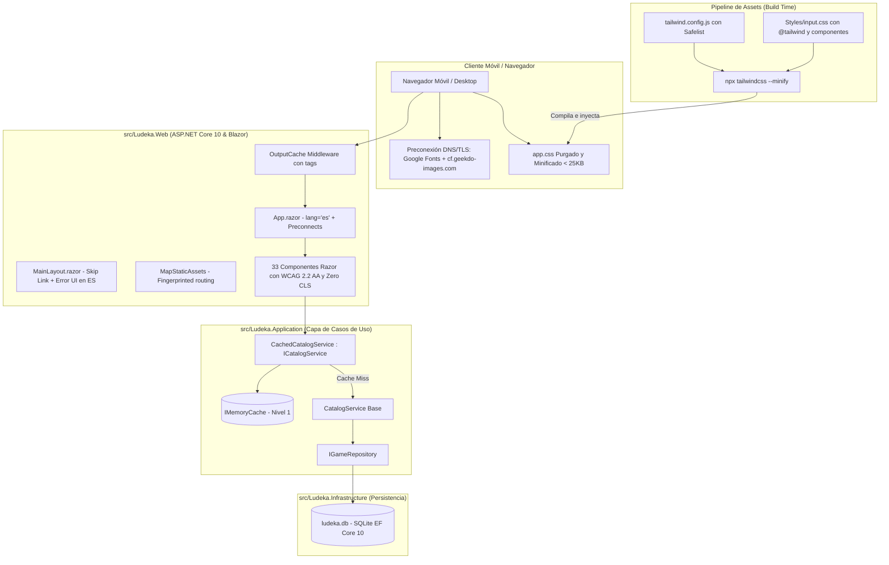

# Diseño Técnico: change-07-production-assets-perf (Incremento 7: Compilación de Producción, Optimización de Assets y Rendimiento Web)

## 1. Visión General de la Arquitectura

El **Incremento 7** optimiza transversalmente la arquitectura de Ludeka en .NET 10 y C# 13, integrando un pipeline de purga y compilación de assets con Tailwind CLI, un esquema de caché de dos niveles (memoria de aplicación y middleware HTTP de salida) y un estándar estricto de accesibilidad WCAG 2.2 Nivel AA.



---

## 2. Pipeline de Assets y Tailwind CSS

### 2.1 Archivo de Configuración `tailwind.config.js`
- **Ubicación:** `src/Ludeka.Web/tailwind.config.js`
- **Estrategia de Purga:**
  ```javascript
  /** @type {import('tailwindcss').Config} */
  module.exports = {
    content: [
      "./Components/**/*.razor",
      "./wwwroot/**/*.html"
    ],
    darkMode: 'class',
    theme: {
      extend: {
        colors: {
          'brand-primary': '#FF5A36',
          'brand-primary-hover': '#FF7252',
          'brand-accent': '#38BDF8',
          'ludeka-bg': '#0B0F17',
          'ludeka-surface': '#141B26',
          'ludeka-card': '#182232',
          'ludeka-border': '#2A364F',
          'mustplay': '#10B981',
          'recommended': '#F59E0B',
          'notrec': '#EF4444'
        },
        fontFamily: {
          sans: ['Plus Jakarta Sans', 'system-ui', '-apple-system', 'sans-serif'],
          mono: ['JetBrains Mono', 'monospace']
        }
      }
    },
    safelist: [
      'status-mustplay',
      'status-recommended',
      'status-notrecommended',
      'active-pill',
      'aspect-square',
      'aspect-video',
      {
        pattern: /(bg|text|border)-(emerald|amber|rose|purple|cyan|slate|orange)-(500|600|700|800|900|950)(\/\d+)?/
      }
    ],
    plugins: []
  }
  ```

### 2.2 Hoja de Entrada `Styles/input.css`
- **Ubicación:** `src/Ludeka.Web/Styles/input.css`
- **Estructura:**
  1. Directivas `@tailwind base; @tailwind components; @tailwind utilities;`
  2. Variables CSS en `:root` (`--bg-main`, `--brand-primary`, etc.)
  3. Clases de componentes editoriales (`.container-ludeka`, `.traffic-chip`, `.badge-pill`, `.game-card-editorial`, `.cover-wrapper`, `.rating-badge-float`, `.search-input`, `.filter-btn`, `.detail-hero-backdrop`).
  4. *Nota crítica de rendimiento:* Cero directivas `@import url(...)`.

### 2.3 Preconexiones en `App.razor`
- **Ubicación:** `src/Ludeka.Web/Components/App.razor`
- **Implementación:**
  ```html
  <head>
      <meta charset="utf-8" />
      <meta name="viewport" content="width=device-width, initial-scale=1.0" />
      <base href="/" />
      <ResourcePreloader />
      <!-- Preconexiones tempranas DNS / TLS -->
      <link rel="preconnect" href="https://fonts.googleapis.com" />
      <link rel="preconnect" href="https://fonts.gstatic.com" crossorigin />
      <link rel="preconnect" href="https://cf.geekdo-images.com" crossorigin />
      <link rel="stylesheet" href="https://fonts.googleapis.com/css2?family=Plus+Jakarta+Sans:wght@400;500;600;700;800&family=JetBrains+Mono:wght@500;700&display=swap" />
      <link rel="stylesheet" href="@Assets["app.css"]" />
      <link rel="stylesheet" href="@Assets["Ludeka.Web.styles.css"]" />
      <ImportMap />
      <HeadOutlet />
  </head>
  ```

---

## 3. Caché Multinivel (Memoria y Output Caching)

### 3.1 Decorador `CachedCatalogService`
- **Ubicación:** `src/Ludeka.Application/Features/Catalog/CachedCatalogService.cs`
- **Diseño del Decorador:**
  ```csharp
  public class CachedCatalogService : ICatalogService
  {
      private readonly ICatalogService _inner;
      private readonly IMemoryCache _cache;
      private static readonly TimeSpan DefaultSlidingExpiration = TimeSpan.FromMinutes(10);
      private static readonly TimeSpan DefaultAbsoluteExpiration = TimeSpan.FromMinutes(30);

      public CachedCatalogService(ICatalogService inner, IMemoryCache cache)
      {
          _inner = inner ?? throw new ArgumentNullException(nameof(inner));
          _cache = cache ?? throw new ArgumentNullException(nameof(cache));
      }

      public async Task<CatalogResult> GetCatalogAsync(GameFilterCriteria criteria, int page = 1, int pageSize = 20, CancellationToken ct = default)
      {
          var cacheKey = $"catalog:p{page}:s{pageSize}:crit_{ComputeCriteriaHash(criteria)}";
          return await _cache.GetOrCreateAsync(cacheKey, async entry =>
          {
              entry.SlidingExpiration = DefaultSlidingExpiration;
              entry.AbsoluteExpirationRelativeToNow = DefaultAbsoluteExpiration;
              return await _inner.GetCatalogAsync(criteria, page, pageSize, ct);
          })!;
      }

      public async Task<GameDetailDto?> GetGameBySlugAsync(string slug, CancellationToken ct = default)
      {
          if (string.IsNullOrWhiteSpace(slug)) return null;
          var cacheKey = $"game:slug:{slug.Trim().ToLowerInvariant()}";
          return await _cache.GetOrCreateAsync(cacheKey, async entry =>
          {
              entry.SlidingExpiration = TimeSpan.FromMinutes(15);
              return await _inner.GetGameBySlugAsync(slug, ct);
          });
      }

      public async Task<IReadOnlyList<GameSummaryDto>> GetQuickSearchAsync(string term, int limit = 5, CancellationToken ct = default)
      {
          if (string.IsNullOrWhiteSpace(term)) return Array.Empty<GameSummaryDto>();
          var cacheKey = $"quicksearch:{term.Trim().ToLowerInvariant()}:l{limit}";
          return await _cache.GetOrCreateAsync(cacheKey, async entry =>
          {
              entry.SlidingExpiration = TimeSpan.FromMinutes(5);
              return await _inner.GetQuickSearchAsync(term, limit, ct);
          }) ?? Array.Empty<GameSummaryDto>();
      }

      public void Invalidate(string? slug = null)
      {
          if (!string.IsNullOrWhiteSpace(slug))
          {
              _cache.Remove($"game:slug:{slug.Trim().ToLowerInvariant()}");
          }
      }
  }
  ```

### 3.2 Configuración en `Program.cs`
- Inyección de memoria:
  ```csharp
  builder.Services.AddMemoryCache();
  builder.Services.AddScoped<CatalogService>();
  builder.Services.AddScoped<ICatalogService>(sp =>
      new CachedCatalogService(
          sp.GetRequiredService<CatalogService>(),
          sp.GetRequiredService<IMemoryCache>()));
  ```
- Output Cache:
  ```csharp
  builder.Services.AddOutputCache(options =>
  {
      options.AddPolicy("CatalogCache", p => p.Expire(TimeSpan.FromMinutes(10)).Tag("tag-catalog"));
      options.AddPolicy("RadarCache", p => p.Expire(TimeSpan.FromMinutes(5)).Tag("tag-radar"));
      options.AddPolicy("StaticPages", p => p.Expire(TimeSpan.FromHours(1)).Tag("tag-static"));
  });
  ...
  app.UseOutputCache();
  ```

---

## 4. Core Web Vitals y Estabilidad Visual (Zero CLS)

### 4.1 Carátula Hero en `GameDetail.razor`
- El contenedor de carátula se fija con `aspect-square`, `shrink-0` y ancho responsive.
- La etiqueta de imagen se actualiza con:
  ```html
  
  ```

### 4.2 Tarjetas de Juego en `GameCard.razor`
- Contenedor `.cover-wrapper` con `aspect-ratio: 1 / 1`.
- Etiqueta de imagen con:
  ```html
  
  ```

### 4.3 Prevención de Fugas de Memoria en `CatalogSearchBar.razor`
- Implementación explícita de `IDisposable`:
  ```razor
  @implements IDisposable
  ...
  @code {
      public void Dispose()
      {
          _debounceTimer?.Dispose();
          _debounceTimer = null;
      }
  }
  ```

---

## 5. Auditoría y Accesibilidad WCAG 2.2 Nivel AA

### 5.1 Enlace de Salto (Skip Link) en `MainLayout.razor`
- Enlace al inicio de `<body>` que se hace visible al enfocar con `Tab`:
  ```html
  <a href="#main-content"
     class="sr-only focus:not-sr-only focus:fixed focus:top-4 focus:left-4 focus:z-50 focus:px-4 focus:py-2 focus:bg-orange-600 focus:text-white focus:rounded-xl focus:shadow-2xl focus:outline-none focus:ring-2 focus:ring-white">
      Saltar al contenido principal
  </a>
  <main class="flex-1" id="main-content" tabindex="-1">
      @Body
  </main>
  ```

### 5.2 Estandarización de Modales con ARIA
Se actualizan los 6 modales (`MediaEmbedModal`, `SocialCardModal`, `LoanModal`, `FoundingVerdictModal`, `ReviewBottomSheet` y modal de sorteos en `Radar`):
```html
<div class="fixed inset-0 z-50 flex items-center justify-center p-4 bg-slate-950/80 backdrop-blur-sm"
     role="dialog"
     aria-modal="true"
     aria-labelledby="[id-del-titulo-del-modal]">
    ...
    <h3 id="[id-del-titulo-del-modal]">Título</h3>
    <button type="button" @onclick="Close" aria-label="Cerrar modal">✕</button>
</div>
```

### 5.3 Semántica en Pestañas Horizontales
En `MultimediaHub.razor`, `Radar.razor` y `MyLibrary.razor`:
- Contenedor: `role="tablist"` y `aria-label="Navegación por pestañas"`.
- Cada pestaña: `role="tab"`, `aria-selected="true/false"`, `aria-controls="panel-id"`.
- Panel: `role="tabpanel"`, `id="panel-id"`, `tabindex="0"`.

---

## 6. Registro de Archivos Afectados

| Archivo | Acción | Propósito |
|---|---|---|
| `src/Ludeka.Application/Features/Catalog/CachedCatalogService.cs` | **Crear** | Decorador de caché con `IMemoryCache` |
| `src/Ludeka.Web/tailwind.config.js` | **Crear** | Configuración de purga y tema de Tailwind CLI |
| `src/Ludeka.Web/Styles/input.css` | **Crear** | Hoja CSS de entrada con directivas y componentes |
| `src/Ludeka.Web/wwwroot/app.css` | **Modificar** | Hoja de estilos purgada y minificada |
| `src/Ludeka.Web/Program.cs` | **Modificar** | Configuración de Output Cache y decorador de catálogo |
| `src/Ludeka.Web/Components/App.razor` | **Modificar** | `lang="es"`, preconexiones y carga optimizada de fuentes |
| `src/Ludeka.Web/Components/Layout/MainLayout.razor` | **Modificar** | Skip link accesible, error UI en español, logo con dimensiones |
| `src/Ludeka.Web/Components/Pages/Home.razor` | **Modificar** | Contenedores anti-CLS y atributos de carga |
| `src/Ludeka.Web/Components/Pages/GameDetail.razor` | **Modificar** | LCP `fetchpriority="high"`, anti-CLS en carátula |
| `src/Ludeka.Web/Components/Pages/Radar.razor` | **Modificar** | Pestañas con ARIA y accesibilidad en modal |
| `src/Ludeka.Web/Components/Pages/MyLibrary.razor` | **Modificar** | Pestañas con ARIA y dimensiones en carátulas |
| `src/Ludeka.Web/Components/Shared/CatalogSearchBar.razor` | **Modificar** | `@implements IDisposable` y liberación de temporizador |
| `src/Ludeka.Web/Components/Shared/GameCard.razor` | **Modificar** | Dimensiones, `decoding="async"` y `loading="lazy"` |
| `src/Ludeka.Web/Components/Shared/MultimediaHub.razor` | **Modificar** | Pestañas ARIA, soporte de teclado en tarjetas |
| `src/Ludeka.Web/Components/Shared/MediaEmbedModal.razor` | **Modificar** | `role="dialog"`, `aria-modal="true"`, `aria-labelledby` |
| `src/Ludeka.Web/Components/Shared/SocialCardModal.razor` | **Modificar** | `role="dialog"`, `aria-modal="true"`, `aria-labelledby` |
| `src/Ludeka.Web/Components/Shared/LoanModal.razor` | **Modificar** | `role="dialog"`, `aria-modal="true"`, `aria-labelledby` |
| `src/Ludeka.Web/Components/Shared/FoundingVerdictModal.razor` | **Modificar** | `role="dialog"`, `aria-modal="true"`, `aria-labelledby` |
| `src/Ludeka.Web/Components/Shared/ReviewBottomSheet.razor` | **Modificar** | `role="dialog"`, `aria-modal="true"`, etiquetas en inputs |
| `src/Ludeka.Web/Components/Shared/ScalabilityTrafficLight.razor` | **Modificar** | `role="img"` o `role="status"` en chips |
| `src/Ludeka.Web/Components/Shared/RuleQuestionsSection.razor` | **Modificar** | `<label for="...">` asociados a inputs |
| `tests/Ludeka.UnitTests/Application/CachedCatalogServiceTests.cs` | **Crear** | Tests unitarios de hits, misses e invalidación de caché |
| `tests/Ludeka.UnitTests/Web/PerformanceAndAccessibilityTests.cs` | **Crear** | Tests de políticas de Output Cache y semántica web |
