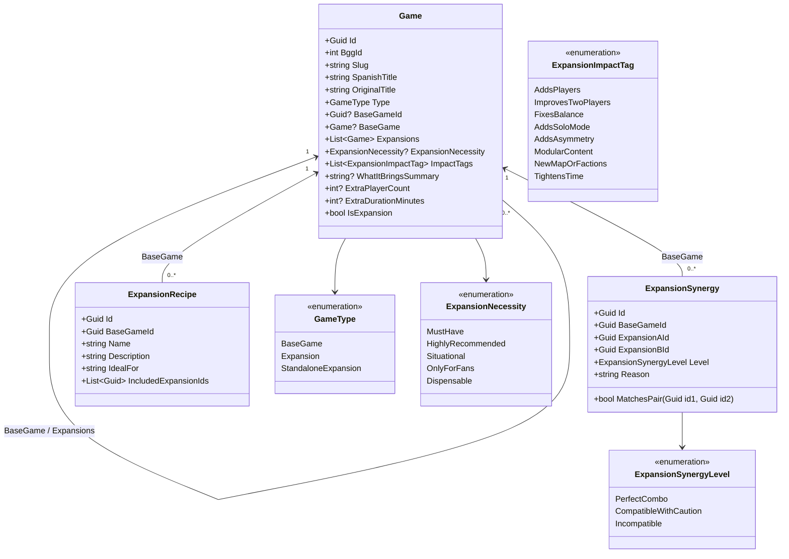

# Diseño Técnico: change-08-game-expansions (Incremento 8: Fichas de Expansión, Ecosistema y Compatibilidad Lúdica)

## 1. Arquitectura de Dominio y Modelo de Entidades



---

## 2. Contratos y Clases de Dominio (`Ludeka.Core`)

### 2.1 Enums Lúdicos
- `GameType`: `BaseGame = 0, Expansion = 1, StandaloneExpansion = 2`.
- `ExpansionNecessity`:
  - `MustHave = 0` ("Imprescindible, mejora el juego base")
  - `HighlyRecommended = 1` ("Muy recomendada")
  - `Situational = 2` ("Recomendada según grupo / jugadores")
  - `OnlyForFans = 3` ("Solo para completistas / muy cafeteros")
  - `Dispensable = 4` ("Prescindible / Aporta poco")
- `ExpansionImpactTag`:
  - `AddsPlayers`, `ImprovesTwoPlayers`, `FixesBalance`, `AddsSoloMode`, `AddsAsymmetry`, `ModularContent`, `NewMapOrFactions`, `TightensTime`.
- `ExpansionSynergyLevel`:
  - `PerfectCombo = 0` (🟢 Sinergia Óptima / Combo Estrella)
  - `CompatibleWithCaution = 1` (🟡 Compatible con Reservas / Sobrecarga)
  - `Incompatible = 2` (🔴 Incompatible / Conflicto)

### 2.2 Entidad `ExpansionSynergy`
```csharp
public class ExpansionSynergy
{
    public Guid Id { get; private set; } = Guid.NewGuid();
    public Guid BaseGameId { get; private set; }
    public Guid ExpansionAId { get; private set; }
    public Guid ExpansionBId { get; private set; }
    public ExpansionSynergyLevel Level { get; private set; }
    public string Reason { get; private set; } = string.Empty;

    private ExpansionSynergy() { }

    public ExpansionSynergy(Guid baseGameId, Guid expansionAId, Guid expansionBId, ExpansionSynergyLevel level, string reason)
    {
        if (baseGameId == Guid.Empty) throw new ArgumentException("El BaseGameId no puede ser vacío.", nameof(baseGameId));
        if (expansionAId == Guid.Empty || expansionBId == Guid.Empty) throw new ArgumentException("Los identificadores de expansión no pueden ser vacíos.");
        if (expansionAId == expansionBId) throw new ArgumentException("Una expansión no puede tener sinergia consigo misma.");

        BaseGameId = baseGameId;
        ExpansionAId = expansionAId;
        ExpansionBId = expansionBId;
        Level = level;
        Reason = reason?.Trim() ?? string.Empty;
    }

    public bool MatchesPair(Guid id1, Guid id2) =>
        (ExpansionAId == id1 && ExpansionBId == id2) || (ExpansionAId == id2 && ExpansionBId == id1);
}
```

### 2.3 Entidad `ExpansionRecipe`
```csharp
public class ExpansionRecipe
{
    public Guid Id { get; private set; } = Guid.NewGuid();
    public Guid BaseGameId { get; private set; }
    public string Name { get; private set; } = string.Empty;
    public string Description { get; private set; } = string.Empty;
    public string IdealFor { get; private set; } = string.Empty;
    public List<Guid> IncludedExpansionIds { get; private set; } = [];

    private ExpansionRecipe() { }

    public ExpansionRecipe(Guid baseGameId, string name, string description, string idealFor, IEnumerable<Guid> includedExpansionIds)
    {
        if (baseGameId == Guid.Empty) throw new ArgumentException("El BaseGameId no puede ser vacío.", nameof(baseGameId));
        if (string.IsNullOrWhiteSpace(name)) throw new ArgumentException("El nombre no puede estar vacío.", nameof(name));

        BaseGameId = baseGameId;
        Name = name.Trim();
        Description = description?.Trim() ?? string.Empty;
        IdealFor = idealFor?.Trim() ?? string.Empty;
        if (includedExpansionIds != null) IncludedExpansionIds.AddRange(includedExpansionIds);
    }
}
```

---

## 3. Capa de Aplicación (`Ludeka.Application`)

### 3.1 DTOs
- `ExpansionSummaryDto`:
  - `Guid Id, int BggId, string Slug, string SpanishTitle, string OriginalTitle, int YearPublished, string? CoverImageUrl, double LudistRating, double BggRating, ExpansionNecessity? Necessity, IReadOnlyList<ExpansionImpactTag> ImpactTags, string? WhatItBringsSummary, int? ExtraPlayerCount, int? ExtraDurationMinutes`.
- `ExpansionDetailDto`:
  - Contiene los datos completos del `GameDetailDto` de la expansión, junto con `BaseGameSummaryDto BaseGame` (Id, Slug, SpanishTitle, CoverImageUrl, Rating), la lista de `ExpansionSynergyDto` con las demás expansiones hermanas, y el desglose de métricas.
- `ExpansionSynergyDto`:
  - `Guid Id, Guid ExpansionAId, string ExpansionATitle, Guid ExpansionBId, string ExpansionBTitle, ExpansionSynergyLevel Level, string Reason`.
- `ExpansionMixerEvaluationDto`:
  - `string GlobalStatus` ("Balanced", "Caution", "Conflict")
  - `string GlobalStatusTitle` ("🟢 Mesa Equilibrada", "🟡 Mesa Exigente", "🔴 Conflicto de Componentes")
  - `string GlobalStatusMessage`
  - `int ResultingMinPlayers, int ResultingMaxPlayers`
  - `int ResultingEstimatedMinutes`
  - `IReadOnlyList<ExpansionSynergyDto> PairwiseSynergies`
  - `IReadOnlyList<string> ConflictWarnings`

### 3.2 Contrato `IExpansionService`
```csharp
public interface IExpansionService
{
    Task<IReadOnlyList<ExpansionSummaryDto>> GetExpansionsForBaseGameAsync(Guid baseGameId, CancellationToken ct = default);
    Task<ExpansionDetailDto?> GetExpansionDetailBySlugAsync(string slug, CancellationToken ct = default);
    Task<IReadOnlyList<ExpansionSynergyDto>> GetSynergiesForBaseGameAsync(Guid baseGameId, CancellationToken ct = default);
    Task<ExpansionMixerEvaluationDto> EvaluateMixerCombinationAsync(Guid baseGameId, IEnumerable<Guid> selectedExpansionIds, CancellationToken ct = default);
    Task<IReadOnlyList<ExpansionRecipeDto>> GetRecipesForBaseGameAsync(Guid baseGameId, CancellationToken ct = default);
}
```

### 3.3 Algoritmo del Evaluador de Mezclador de Mesa
1. Obtiene el juego base y todas las expansiones seleccionadas.
2. Si no hay expansiones seleccionadas: devuelve las métricas base con estado "Balanced".
3. Calcula métricas combinadas:
   - `MaxPlayers = BaseGame.MaxPlayers + Max(ExtraPlayerCount en las expansiones seleccionadas)`.
   - `EstimatedMinutes = BaseGame.EstimatedMinutes + Sum(ExtraDurationMinutes)`.
4. Evalúa todos los pares de expansiones seleccionadas contra las sinergias registradas:
   - Si algún par tiene `Level == Incompatible` -> Estado = `Conflict`. Se añade advertencia severa.
   - Si no hay conflictos pero algún par tiene `Level == CompatibleWithCaution` o la duración estimada supera 120 minutos -> Estado = `Caution`. Se añade aviso de sobrecarga.
   - En caso contrario -> Estado = `Balanced` ("🟢 Mesa Óptima: Las expansiones se combinan limpiamente").

---

## 4. Persistencia en `Ludeka.Infrastructure`

### 4.1 Configuración de EF Core 10 (`LudekaDbContext`)
- `DbSet<ExpansionSynergy> ExpansionSynergies => Set<ExpansionSynergy>();`
- `DbSet<ExpansionRecipe> ExpansionRecipes => Set<ExpansionRecipe>();`
- Mapeo en `OnModelCreating`:
  ```csharp
  // Relación reflexiva Game -> BaseGame
  game.HasOne(g => g.BaseGame)
      .WithMany(g => g.Expansions)
      .HasForeignKey(g => g.BaseGameId)
      .OnDelete(DeleteBehavior.Restrict);

  game.HasIndex(g => g.BaseGameId);
  game.HasIndex(g => g.Type);
  game.OwnsMany(g => g.ImpactTags, b => b.ToJson());

  // ExpansionSynergy
  var synergy = modelBuilder.Entity<ExpansionSynergy>();
  synergy.ToTable("ExpansionSynergies");
  synergy.HasKey(s => s.Id);
  synergy.HasIndex(s => s.BaseGameId);
  synergy.HasIndex(s => new { s.ExpansionAId, s.ExpansionBId });

  // ExpansionRecipe
  var recipe = modelBuilder.Entity<ExpansionRecipe>();
  recipe.ToTable("ExpansionRecipes");
  recipe.HasKey(r => r.Id);
  recipe.HasIndex(r => r.BaseGameId);
  recipe.OwnsMany(r => r.IncludedExpansionIds, b => b.ToJson());
  ```

---

## 5. Componentes Razor en `Ludeka.Web`

1. `Components/Shared/ExpansionEcosystemSection.razor`:
   - Componente de pestañas incrustado en `GameDetail.razor` cuando el juego es base.
   - Pestaña 1: Grid de tarjetas de expansiones con píldoras de aporte y veredicto.
   - Pestaña 2: Selector interactivo de expansiones con tarjetas seleccionables y panel de diagnóstico en tiempo real.
   - Pestaña 3: Tarjetas de recetas prediseñadas con botón "Cargar en el mezclador".
2. `Components/Shared/ExpansionAporteCard.razor`:
   - Tarjeta editorial en la ficha de la expansión con el veredicto destacado, chips de qué aporta, métricas delta y resumen editorial.
3. `Components/Shared/ExpansionSisterList.razor`:
   - Listado de expansiones hermanas con badges de sinergia directa respecto a la expansión activa.
4. `Components/Shared/ParentGameBanner.razor`:
   - Banner superior en la ficha de la expansión con enlace directo al juego base nodriza.
5. Modificación de `GameCard.razor` y `Catalog.razor`:
   - Badge visual `🧩 Expansión`.
   - Filtro de catálogo por tipo de juego (`Todos`, `Juegos Base`, `Expansiones`).
