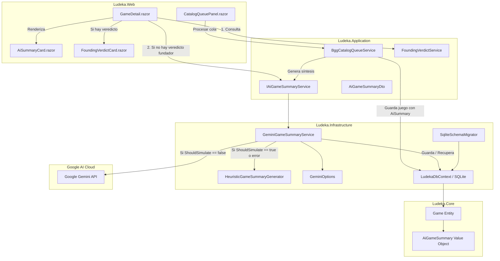

# Diseño Técnico: change-13-ai-game-summary (Incremento 13: Módulo de Síntesis con IA)

## 1. Diagrama de Componentes y Flujo



---

## 2. Definición del Modelo de Dominio

### 2.1 Value Object `AiGameSummary`
Ubicación: `src/Ludeka.Core/ValueObjects/AiGameSummary.cs`.
```csharp
namespace Ludeka.Core.ValueObjects;

public record AiGameSummary(
    string GeneralVerdict,
    string ScalabilitySummary,
    string AgeSummary,
    string FootprintSummary,
    string Model,
    DateTime GeneratedAt
);
```

### 2.2 Entidad `Game`
Ubicación: `src/Ludeka.Core/Entities/Game.cs`.
- Propiedad:
  ```csharp
  public AiGameSummary? AiSummary { get; private set; }
  ```
- Método mutador de encapsulamiento:
  ```csharp
  public void SetAiSummary(AiGameSummary summary)
  {
      ArgumentNullException.ThrowIfNull(summary);
      AiSummary = summary;
  }
  ```

---

## 3. Capa de Infraestructura: Opciones, Generador y Cliente Gemini

### 3.1 Opciones de Configuración (`GeminiOptions`)
```csharp
namespace Ludeka.Infrastructure.Services;

public class GeminiOptions
{
    public const string SectionName = "Gemini";

    public string? ApiKey { get; set; }
    public string Model { get; set; } = "gemini-2.5-flash";
    public string BaseUrl { get; set; } = "https://generativelanguage.googleapis.com/v1beta/";
    public bool Simulate { get; set; } = true;

    public bool ShouldSimulate => Simulate || string.IsNullOrWhiteSpace(ApiKey);
}
```

### 3.2 Generador Heurístico Local (`HeuristicGameSummaryGenerator`)
Construye de manera determinista un resumen en español rico y fundamentado analizando:
- `Scalability`: Comensales ideales (`IdealPlayerCountText`), dinámica de entreturno, adaptación a 2 personas.
- `AgeRating`: Edad legal de componentes (`BoxAge`) vs. edad comunitaria (`CommunityAge`).
- `TableFootprint`: Superficie de mesa (`SmallTable`, `StandardTable`, `TableMonster`).
- `GameDuration`: Minutos por comensal y rango total de partida.
- `Confrontation` y `GameStyle`: Grado de interacción y estilo de juego.
- `BggRating`: Valoración global de la comunidad.

### 3.3 Cliente Gemini (`GeminiGameSummaryService`)
- Implementa `IAiGameSummaryService`.
- Al recibir una solicitud:
  - Si `_options.ShouldSimulate`: invoca `HeuristicGameSummaryGenerator.Generate(...)` con `Model = "Heurística Editorial"`.
  - Si no simula:
    - Construye el payload JSON con `generationConfig.responseMimeType = "application/json"`.
    - Envía la petición HTTP `POST` a `{BaseUrl}models/{Model}:generateContent?key={ApiKey}`.
    - Deserializa la respuesta extrayendo `generalVerdict`, `scalabilitySummary`, `ageSummary`, `footprintSummary`.
    - En caso de fallo de red o error de API, captura la excepción, registra un log de advertencia y devuelve el resumen heurístico con `Model = "Heurística Editorial (Fallback)"`.

---

## 4. Persistencia en Base de Datos y Reconciliación SQLite

### 4.1 Mapeo EF Core (`LudekaDbContext.cs`)
```csharp
game.OwnsOne(g => g.AiSummary, b => b.ToJson());
```

### 4.2 Reconciliación Defensiva (`SqliteSchemaMigrator.cs`)
En `columnsToAdd`:
```csharp
("AiSummary", "TEXT NULL")
```
Esto asegura que las bases de datos SQLite locales preexistentes incorporen la columna sin perder registros de juegos, colecciones o préstamos.

---

## 5. Integración con la Cola Comunitaria de BGG

En `BggCatalogQueueService.ProcessPendingQueueBatchAsync`:
```csharp
var existingGame = await _gameRepo.GetByBggIdAsync(pending.BggId, ct);
Guid gameId;
if (existingGame == null)
{
    var summaryDto = await _aiSummaryService.GenerateSummaryAsync(fetchedGame, ct);
    fetchedGame.SetAiSummary(new AiGameSummary(
        summaryDto.GeneralVerdict,
        summaryDto.ScalabilitySummary,
        summaryDto.AgeSummary,
        summaryDto.FootprintSummary,
        summaryDto.Model,
        summaryDto.GeneratedAt ?? DateTime.UtcNow
    ));

    await _gameRepo.AddRangeAsync([fetchedGame], ct);
    gameId = fetchedGame.Id;
}
else
{
    gameId = existingGame.Id;
}
```

---

## 6. Interfaz de Usuario (`AiSummaryCard.razor`)

- Encabezado con badge: `🤖 Resumen generado por IA`.
- Badge secundario con el modelo: `Gemini 2.5 Flash` (con icono de destello o robot) o `Heurística Editorial`.
- Bloques en grid responsivo:
  - 👥 **Escalabilidad**: Rango óptimo y fluidez de mesa.
  - 🧒 **Accesibilidad & Edad**: Edad real frente a edad de caja.
  - 📐 **Espacio y Tiempo**: Despliegue de mesa y duración estimada.
- Veredicto general sintetizado.
- Banner explicativo de ciclo de vida (se retira automáticamente al crearse un Veredicto Fundador).
