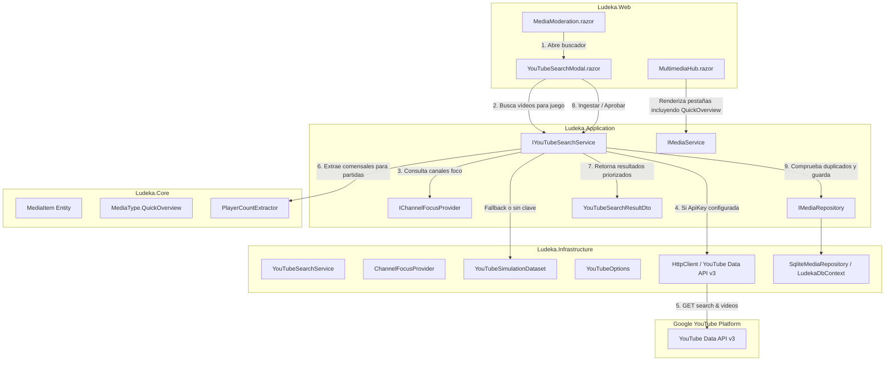

# Diseño Técnico: change-14-youtube-live-search (Incremento 14)

## 1. Diagrama de Componentes y Flujo de Búsqueda



---

## 2. Dominio (`Ludeka.Core`)

### 2.1 Ampliación de `MediaType`
En [`src/Ludeka.Core/Enums/MediaType.cs`](file:///c:/repos/Ludeka/src/Ludeka.Core/Enums/MediaType.cs):
```csharp
public enum MediaType
{
    Tutorial,
    Playthrough,
    InstagramPost,
    ShortReel,
    QuickOverview // ⚡ "Cómo funciona / Vistazo en 2 min"
}
```

### 2.2 Extractor de Comensales (`PlayerCountExtractor`)
Ubicación: `src/Ludeka.Core/Helpers/PlayerCountExtractor.cs`
- Expresiones regulares:
  - `(?i)\b(?:partida|duelo|gameplay)\s+a\s*(\d+)\b`
  - `(?i)\ba\s*(\d+)\s*(?:jugadores?|players?|comensales|p)?\b`
  - `(?i)\b(?:solitario|solo|en solitario)\b` -> `"Partida en solitario"`
  - `(?i)\ba\s*(dos|tres|cuatro|cinco)\s*(?:jugadores?)?\b`
- Fallback a la entidad `Game`:
  - Si el juego tiene escalabilidad definida, toma la mejor recomendación (ej. `"Partida a 2"`).
  - Si no, toma el rango `"Partida a {MinPlayers}-{MaxPlayers}"`.
  - Garantiza que `MediaItem.PlayerCountBadge` nunca sea nulo ni vacío al crear un `Playthrough`.

---

## 3. Contratos y DTOs (`Ludeka.Application`)

### 3.1 DTOs en `src/Ludeka.Application/DTOs/YouTubeDtos.cs`
```csharp
public record YouTubeSearchResultDto(
    string VideoId,
    string Title,
    string Description,
    string Url,
    string EmbedUrl,
    string ThumbnailUrl,
    string ChannelTitle,
    int? DurationSeconds,
    string FormattedDuration,
    MediaType SuggestedType,
    string? ExtractedPlayerBadge,
    int RelevanceScore,
    bool IsReferenceChannel,
    DateTimeOffset? PublishedAt
);

public record YouTubeIngestRequestDto(
    Guid GameId,
    string VideoId,
    MediaType Type,
    string Title,
    string Url,
    string ThumbnailUrl,
    string ChannelTitle,
    int? DurationSeconds,
    string? PlayerCountBadge,
    bool AutoApprove = false
);
```

### 3.2 Contrato `IChannelFocusProvider`
Ubicación: `src/Ludeka.Application/Contracts/IChannelFocusProvider.cs`
```csharp
public interface IChannelFocusProvider
{
    IReadOnlyList<ChannelFocusEntry> GetReferenceChannels();
    bool IsReferenceChannel(string channelTitle, out ChannelCategory category, out int priorityBonus);
}

public record ChannelFocusEntry(
    string ChannelName,
    ChannelCategory Category, // Publisher, Creator, Store
    string? ChannelId = null,
    string? Description = null
);

public enum ChannelCategory
{
    Publisher,
    Creator,
    Store
}
```

### 3.3 Contrato `IYouTubeSearchService`
Ubicación: `src/Ludeka.Application/Contracts/IYouTubeSearchService.cs`
```csharp
public interface IYouTubeSearchService
{
    Task<IReadOnlyList<YouTubeSearchResultDto>> SearchVideosForGameAsync(Guid gameId, CancellationToken ct = default);
    Task<IReadOnlyList<YouTubeSearchResultDto>> SearchQuickOverviewsAsync(string gameTitle, CancellationToken ct = default);
    Task<IReadOnlyList<YouTubeSearchResultDto>> SearchTutorialsAsync(string gameTitle, CancellationToken ct = default);
    Task<IReadOnlyList<YouTubeSearchResultDto>> SearchPlaythroughsAsync(string gameTitle, Guid? gameId = null, CancellationToken ct = default);
    Task<MediaItemDto> IngestVideoAsync(YouTubeIngestRequestDto request, CancellationToken ct = default);
    Task<IReadOnlyList<MediaItemDto>> AutoSuggestAndIngestForGameAsync(Guid gameId, bool autoApprove = false, CancellationToken ct = default);
}
```

---

## 4. Infraestructura (`Ludeka.Infrastructure`)

### 4.1 Configuración `YouTubeOptions`
Ubicación: `src/Ludeka.Infrastructure/YouTube/YouTubeOptions.cs`
```csharp
public class YouTubeOptions
{
    public const string SectionName = "YouTube";
    public string? ApiKey { get; set; }
    public string BaseUrl { get; set; } = "https://www.googleapis.com/youtube/v3/";
    public bool Simulate { get; set; } = false;
    public bool ShouldSimulate => Simulate || string.IsNullOrWhiteSpace(ApiKey);
}
```

### 4.2 Servicio `YouTubeSearchService`
Ubicación: `src/Ludeka.Infrastructure/YouTube/YouTubeSearchService.cs`
- Inyecta `HttpClient`, `IOptions<YouTubeOptions>`, `IChannelFocusProvider`, `IGameRepository`, `IMediaRepository`.
- Si `ShouldSimulate == false`:
  - Llama al endpoint `GET https://www.googleapis.com/youtube/v3/search?part=snippet&q={query}&type=video&relevanceLanguage=es&maxResults=5&key={apiKey}`.
  - Extrae los VideoIds y llama a `GET https://www.googleapis.com/youtube/v3/videos?part=snippet,contentDetails&id={ids}&key={apiKey}`.
  - Parsea la duración ISO 8601 mediante `XmlConvert.ToTimeSpan(isoDuration)`.
  - Calcula `RelevanceScore` sumando bonificaciones si el canal pertenece a `ChannelFocusProvider` y si contiene palabras clave ("cómo funciona", "tutorial", "partida a 2").
- Si `ShouldSimulate == true` o se produce error de red:
  - Conmuta a `YouTubeSimulationDataset`.
- En `IngestVideoAsync`:
  - Valida que no exista ya el vídeo por URL mediante `IMediaRepository.ExistsByUrlAsync`.
  - Construye la entidad `MediaItem` con su estado correspondiente (`PendingApproval` o `Approved`).
  - Persiste y devuelve el DTO.

---

## 5. Presentación Blazor (`Ludeka.Web`)

### 5.1 `MediaModeration.razor`
- Rutas: `@page "/moderacion-media"`, `@page "/moderacion/multimedia"`, `@page "/admin/moderacion-medios"`.
- Modal `YouTubeSearchModal` o sección embebida con buscador reactivo de juegos.
- Tres pestañas de resultados:
  - `⚡ Cómo funciona (~2 min)`
  - `🎬 Tutoriales (8–25 min)`
  - `🎲 Partidas Completas`
- Cada tarjeta muestra miniatura 16:9, duración, autor, badge de jugadores (en partidas) e indicador de canal oficial destacado.
- Acciones: Previsualizar en modal embebido, `📥 Guardar en Pendientes`, `✅ Aprobar Directo`.

### 5.2 `MultimediaHub.razor`
- Añadir pestaña: `⚡ Cómo funciona` con recuento de vídeos `QuickOverview`.
- Presentación en tarjetas horizontales con badge `⚡ Mecánicas en 2 min`.
