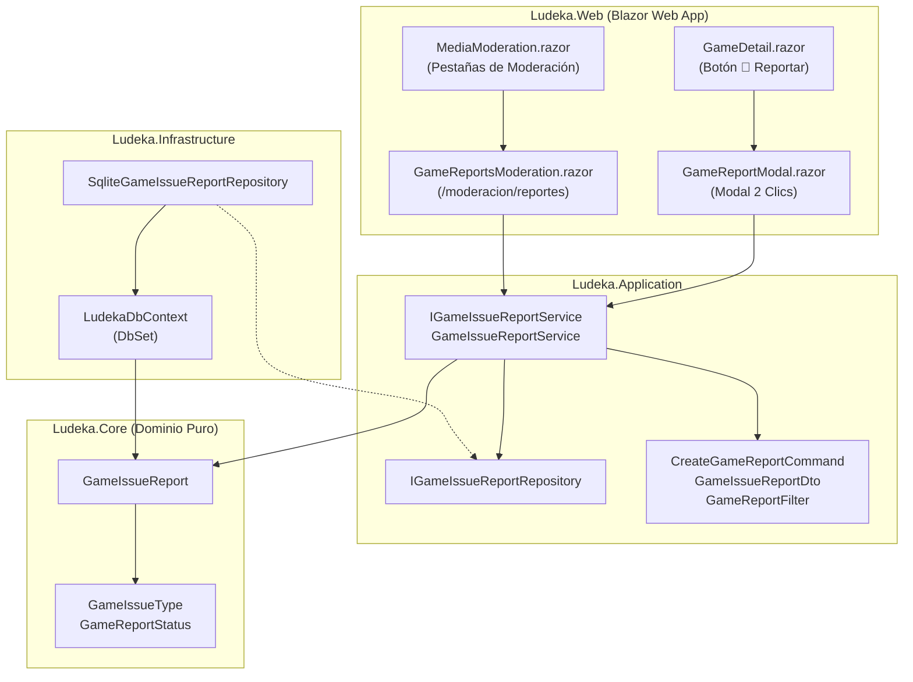
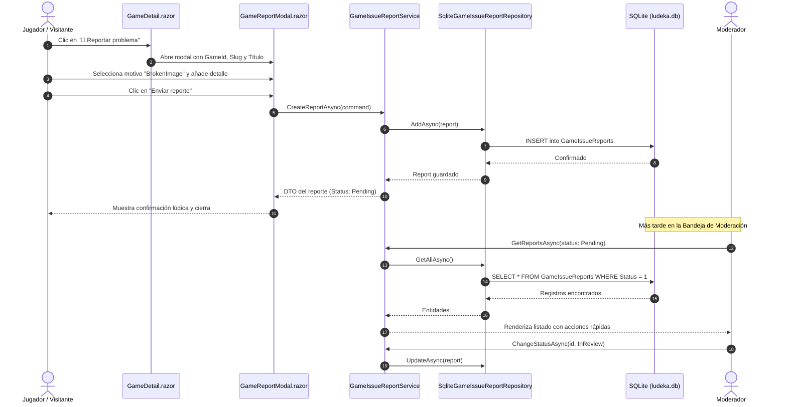

# Diseño Técnico: change-17-community-error-reports (Incremento 17: Sistema Comunitario de Reporte de Errores y Bandeja de Moderación de Fichas)

## 1. Arquitectura General y Clean Architecture

El diseño se articula sobre el patrón Clean Architecture respetando el aislamiento estricto de capas y el flujo de dependencias unidireccional:



---

## 2. Modelo de Dominio (`Ludeka.Core`)

### 2.1 Enumerados
```csharp
namespace Ludeka.Core.Enums;

public enum GameIssueType
{
    WrongImage = 1,          // Imagen incorrecta, desactualizada o de otra edición
    BrokenImage = 2,         // Imagen no carga o enlace roto
    IncorrectPlayerCount = 3,// Número de jugadores o semáforo desajustado
    IncorrectDuration = 4,   // Duración de partida errónea
    IncorrectAge = 5,        // Edad recomendada incorrecta
    ErroneousMetadata = 6,   // Título, diseñador, editorial, año o sinopsis con erratas
    BrokenPurchaseLink = 7,  // Enlace a tienda o afiliado roto o sin stock permanente
    Other = 8                // Otro problema o sugerencia libre
}

public enum GameReportStatus
{
    Pending = 1,   // Pendiente de triaje
    InReview = 2,  // En revisión activa por un moderador
    Resolved = 3,  // Resuelto y subsanado
    Dismissed = 4  // Descartado (falso positivo, duplicado o no aplicable)
}
```

### 2.2 Entidad `GameIssueReport`
```csharp
namespace Ludeka.Core.Entities;

public class GameIssueReport
{
    public Guid Id { get; private set; } = Guid.NewGuid();
    public Guid GameId { get; private set; }
    public string GameSlug { get; private set; } = string.Empty;
    public string GameTitle { get; private set; } = string.Empty;
    public GameIssueType IssueType { get; private set; }
    public string? Details { get; private set; }
    public string? ReportedByUserId { get; private set; }
    public string ReporterNameOrAlias { get; private set; } = "Comunidad anónima";
    public GameReportStatus Status { get; private set; } = GameReportStatus.Pending;
    public string? ModeratorNotes { get; private set; }
    public string? ResolvedByUserId { get; private set; }
    public DateTimeOffset CreatedAt { get; private set; } = DateTimeOffset.UtcNow;
    public DateTimeOffset? UpdatedAt { get; private set; }
    public DateTimeOffset? ResolvedAt { get; private set; }

    private GameIssueReport() { }

    public GameIssueReport(
        Guid gameId,
        string gameSlug,
        string gameTitle,
        GameIssueType issueType,
        string? details,
        string? reporterNameOrAlias = null,
        string? reportedByUserId = null)
    {
        if (gameId == Guid.Empty)
            throw new ArgumentException("El identificador del juego no puede estar vacío.", nameof(gameId));
        if (string.IsNullOrWhiteSpace(gameSlug))
            throw new ArgumentException("El slug del juego no puede estar vacío.", nameof(gameSlug));
        if (string.IsNullOrWhiteSpace(gameTitle))
            throw new ArgumentException("El título del juego no puede estar vacío.", nameof(gameTitle));

        GameId = gameId;
        GameSlug = gameSlug.Trim();
        GameTitle = gameTitle.Trim();
        IssueType = issueType;
        Details = string.IsNullOrWhiteSpace(details) ? null : details.Trim();
        ReporterNameOrAlias = string.IsNullOrWhiteSpace(reporterNameOrAlias) ? "Comunidad anónima" : reporterNameOrAlias.Trim();
        ReportedByUserId = string.IsNullOrWhiteSpace(reportedByUserId) ? null : reportedByUserId.Trim();
        Status = GameReportStatus.Pending;
        CreatedAt = DateTimeOffset.UtcNow;
    }

    public void MarkAsInReview(string moderatorId, string? notes = null)
    {
        if (string.IsNullOrWhiteSpace(moderatorId))
            throw new ArgumentException("Debe especificarse el moderador que toma el reporte en revisión.", nameof(moderatorId));

        Status = GameReportStatus.InReview;
        ResolvedByUserId = moderatorId.Trim();
        if (!string.IsNullOrWhiteSpace(notes))
            ModeratorNotes = notes.Trim();
        UpdatedAt = DateTimeOffset.UtcNow;
    }

    public void Resolve(string moderatorId, string? notes = null)
    {
        if (string.IsNullOrWhiteSpace(moderatorId))
            throw new ArgumentException("Debe especificarse el moderador que resuelve el reporte.", nameof(moderatorId));

        Status = GameReportStatus.Resolved;
        ResolvedByUserId = moderatorId.Trim();
        if (!string.IsNullOrWhiteSpace(notes))
            ModeratorNotes = notes.Trim();
        ResolvedAt = DateTimeOffset.UtcNow;
        UpdatedAt = DateTimeOffset.UtcNow;
    }

    public void Dismiss(string moderatorId, string reason)
    {
        if (string.IsNullOrWhiteSpace(moderatorId))
            throw new ArgumentException("Debe especificarse el moderador que descarta el reporte.", nameof(moderatorId));
        if (string.IsNullOrWhiteSpace(reason))
            throw new ArgumentException("Debe indicarse el motivo del descarte.", nameof(reason));

        Status = GameReportStatus.Dismissed;
        ResolvedByUserId = moderatorId.Trim();
        ModeratorNotes = reason.Trim();
        ResolvedAt = DateTimeOffset.UtcNow;
        UpdatedAt = DateTimeOffset.UtcNow;
    }

    public void Reopen()
    {
        Status = GameReportStatus.Pending;
        ResolvedAt = null;
        UpdatedAt = DateTimeOffset.UtcNow;
    }
}
```

---

## 3. Capa de Aplicación (`Ludeka.Application`)

### 3.1 Contratos
- `IGameIssueReportRepository`:
  - `ValueTask<GameIssueReport?> GetByIdAsync(Guid id, CancellationToken ct = default);`
  - `ValueTask<IReadOnlyList<GameIssueReport>> GetAllAsync(GameReportFilter filter, CancellationToken ct = default);`
  - `ValueTask<GameIssueReportSummaryDto> GetSummaryAsync(CancellationToken ct = default);`
  - `ValueTask AddAsync(GameIssueReport report, CancellationToken ct = default);`
  - `ValueTask UpdateAsync(GameIssueReport report, CancellationToken ct = default);`
- `IGameIssueReportService`:
  - `ValueTask<GameIssueReportDto> CreateReportAsync(CreateGameReportCommand command, CancellationToken ct = default);`
  - `ValueTask<IReadOnlyList<GameIssueReportDto>> GetReportsAsync(GameReportFilter filter, CancellationToken ct = default);`
  - `ValueTask<GameIssueReportSummaryDto> GetSummaryAsync(CancellationToken ct = default);`
  - `ValueTask<GameIssueReportDto?> ChangeStatusAsync(Guid id, UpdateGameReportStatusCommand command, CancellationToken ct = default);`

### 3.2 DTOs y Comandos
- `CreateGameReportCommand`:
  - `Guid GameId`, `string GameSlug`, `string GameTitle`, `GameIssueType IssueType`, `string? Details`, `string? ReporterNameOrAlias`, `string? UserId`.
- `UpdateGameReportStatusCommand`:
  - `GameReportStatus NewStatus`, `string ModeratorId`, `string? Notes`.
- `GameReportFilter`:
  - `GameReportStatus? Status`, `GameIssueType? IssueType`, `Guid? GameId`, `string? SearchTerm`, `int Page = 1`, `int PageSize = 50`.
- `GameIssueReportDto`: Proyección para vistas y componentes.
- `GameIssueReportSummaryDto`: Conteos rápidos (`TotalCount`, `PendingCount`, `InReviewCount`, `ResolvedCount`, `DismissedCount`).

---

## 4. Capa de Infraestructura (`Ludeka.Infrastructure`)

### 4.1 Configuración de Entity Framework Core en `LudekaDbContext`
```csharp
public DbSet<GameIssueReport> IssueReports => Set<GameIssueReport>();

// En OnModelCreating:
var report = modelBuilder.Entity<GameIssueReport>();
report.ToTable("GameIssueReports");
report.HasKey(r => r.Id);

report.HasIndex(r => r.GameId);
report.HasIndex(r => r.Status);
report.HasIndex(r => r.IssueType);
report.HasIndex(r => r.CreatedAt);
report.HasIndex(r => new { r.Status, r.CreatedAt });

report.Property(r => r.GameSlug).IsRequired().HasMaxLength(200);
report.Property(r => r.GameTitle).IsRequired().HasMaxLength(250);
report.Property(r => r.Details).HasMaxLength(1000);
report.Property(r => r.ReporterNameOrAlias).HasMaxLength(100);
report.Property(r => r.ModeratorNotes).HasMaxLength(1000);
report.Property(r => r.ResolvedByUserId).HasMaxLength(100);
report.Property(r => r.ReportedByUserId).HasMaxLength(100);
```

### 4.2 Repositorio `SqliteGameIssueReportRepository`
Implementa las operaciones optimizadas con `AsNoTracking()` para lecturas, filtros dinámicos basados en `IQueryable` y conteos agrupados para el resumen.

---

## 5. Capa de Presentación Web (`Ludeka.Web`)

### 5.1 Componente `GameReportModal.razor`
- Modal dialog accesible (`role="dialog"`, `aria-modal="true"`, `aria-labelledby="report-modal-title"`).
- Opciones de reporte en una cuadrícula clara de botones/tarjetas:
  - 🖼️ `WrongImage` ("Imagen incorrecta o de otra edición")
  - 🚫 `BrokenImage` ("La imagen no carga o enlace roto")
  - 👥 `IncorrectPlayerCount` ("Número de jugadores o semáforo")
  - ⏱️ `IncorrectDuration` ("Duración de partida")
  - 🎂 `IncorrectAge` ("Edad recomendada")
  - 📝 `ErroneousMetadata` ("Erratas en título, editorial o autor")
  - 🛒 `BrokenPurchaseLink` ("Enlace de compra o afiliado roto")
  - 💬 `Other` ("Otro problema o sugerencia")
- Estado de envío con animación y microtexto de confirmación:
  - *"¡Muchas gracias por ayudarnos a mantener el catálogo impecable! Un moderador lo revisará pronto."*

### 5.2 Componente de Moderación `GameReportsModeration.razor` (`/moderacion/reportes`)
- Integración fluida con `MainLayout` y `MediaModeration`.
- Métricas superiores con insignias de color:
  - 🟡 **Pendientes** (`PendingCount`)
  - 🔵 **En Revisión** (`InReviewCount`)
  - 🟢 **Resueltos** (`ResolvedCount`)
  - ⚪ **Descartados** (`DismissedCount`)
- Filtros por pestañas y buscador contextual.
- Listado editorial de reportes con badges compactos de 3 segundos, detalles expandibles y acciones directas:
  - *"Tomar en revisión"* (1 clic)
  - *"Resolver"* (modal con campo de notas)
  - *"Descartar"* (modal con campo de motivo)
  - *"Ir a la Ficha"* (enlace con icono externo)

---

## 6. Diagrama de Secuencia


