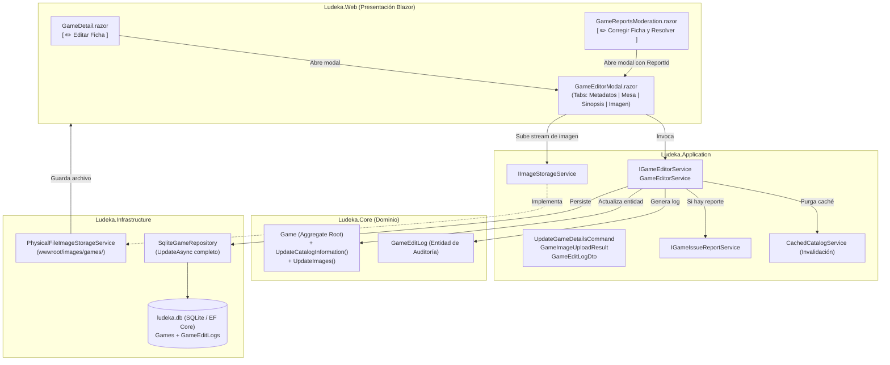

# Diseño Técnico: change-18-moderator-game-editor (Incremento 18: Editor Editorial de Fichas de Catálogo y Carga de Imágenes para Moderadores)

## 1. Arquitectura General y Clean Architecture

El diseño sigue estrictamente los principios de Clean Architecture y la separación de responsabilidades:



---

## 2. Modelo de Dominio (`Ludeka.Core`)

### 2.1 Enriquecimiento de `Game.cs`

Añadimos el método de dominio `UpdateCatalogInformation` para actualizar todos los metadatos y parámetros de mesa, garantizando las invariantes de negocio:

```csharp
namespace Ludeka.Core.Entities;

public partial class Game
{
    public void UpdateCatalogInformation(
        string spanishTitle,
        string originalTitle,
        string designer,
        string publisher,
        int yearPublished,
        string? description,
        ConfrontationType confrontation,
        GameStyle style,
        bool isOfficialSolo,
        AgeRating age,
        LanguageDependence language,
        TableFootprint footprint,
        GameDuration duration,
        int minPlayers,
        int maxPlayers)
    {
        if (string.IsNullOrWhiteSpace(spanishTitle))
            throw new ArgumentException("El título en español no puede estar vacío.", nameof(spanishTitle));
        if (string.IsNullOrWhiteSpace(originalTitle))
            throw new ArgumentException("El título original no puede estar vacío.", nameof(originalTitle));
        if (yearPublished < 1900 || yearPublished > 2100)
            throw new ArgumentOutOfRangeException(nameof(yearPublished), "El año de publicación debe estar entre 1900 y 2100.");
        if (minPlayers <= 0)
            throw new ArgumentOutOfRangeException(nameof(minPlayers), "El número mínimo de jugadores debe ser mayor a 0.");
        if (maxPlayers < minPlayers)
            throw new ArgumentException("El número máximo de jugadores no puede ser menor al mínimo.", nameof(maxPlayers));

        SpanishTitle = spanishTitle.Trim();
        OriginalTitle = originalTitle.Trim();
        Designer = designer?.Trim() ?? string.Empty;
        Publisher = publisher?.Trim() ?? string.Empty;
        YearPublished = yearPublished;
        Description = description?.Trim();
        Confrontation = confrontation;
        Style = style;
        IsOfficialSolo = isOfficialSolo;
        Age = age ?? throw new ArgumentNullException(nameof(age));
        Language = language;
        Footprint = footprint;
        Duration = duration ?? throw new ArgumentNullException(nameof(duration));

        AdjustScalability(minPlayers, maxPlayers);
    }

    private void AdjustScalability(int minPlayers, int maxPlayers)
    {
        var existingDict = Scalability.ToDictionary(s => s.PlayerCount);
        var updated = new List<ScalabilityEntry>();

        for (int p = minPlayers; p <= maxPlayers; p++)
        {
            if (existingDict.TryGetValue(p, out var existingEntry))
            {
                updated.Add(existingEntry);
            }
            else
            {
                string display = p >= 7 ? "7+" : p.ToString();
                updated.Add(new ScalabilityEntry(p, display, ScalabilityStatus.Recommended));
            }
        }

        Scalability.Clear();
        Scalability.AddRange(updated);
    }
}
```

### 2.2 Entidad de Auditoría `GameEditLog.cs`

```csharp
namespace Ludeka.Core.Entities;

public class GameEditLog
{
    public Guid Id { get; private set; } = Guid.NewGuid();
    public Guid GameId { get; private set; }
    public string EditorUserId { get; private set; } = string.Empty;
    public string EditorName { get; private set; } = string.Empty;
    public string SummaryOfChanges { get; private set; } = string.Empty;
    public Guid? AssociatedReportId { get; private set; }
    public DateTimeOffset EditedAt { get; private set; } = DateTimeOffset.UtcNow;

    private GameEditLog() { }

    public GameEditLog(
        Guid gameId,
        string editorUserId,
        string editorName,
        string summaryOfChanges,
        Guid? associatedReportId = null)
    {
        if (gameId == Guid.Empty) throw new ArgumentException("El GameId no puede estar vacío.", nameof(gameId));
        if (string.IsNullOrWhiteSpace(editorUserId)) throw new ArgumentException("El EditorUserId no puede estar vacío.", nameof(editorUserId));

        GameId = gameId;
        EditorUserId = editorUserId.Trim();
        EditorName = string.IsNullOrWhiteSpace(editorName) ? EditorUserId : editorName.Trim();
        SummaryOfChanges = string.IsNullOrWhiteSpace(summaryOfChanges) ? "Edición de ficha" : summaryOfChanges.Trim();
        AssociatedReportId = associatedReportId;
        EditedAt = DateTimeOffset.UtcNow;
    }
}
```

---

## 3. Capa de Aplicación (`Ludeka.Application`)

### 3.1 DTOs y Comandos (`GameEditorDtos.cs`)

```csharp
namespace Ludeka.Application.DTOs;

public record UpdateGameDetailsCommand(
    Guid GameId,
    string SpanishTitle,
    string OriginalTitle,
    string Designer,
    string Publisher,
    int YearPublished,
    string? Description,
    int MinPlayers,
    int MaxPlayers,
    int MinDurationMinutes,
    int MaxDurationMinutes,
    int EstimatedPerPlayerMinutes,
    int BoxAge,
    int CommunityAge,
    ConfrontationType Confrontation,
    GameStyle Style,
    bool IsOfficialSolo,
    LanguageDependence Language,
    TableFootprint Footprint,
    string? CoverImageUrl,
    Guid? AssociatedReportId = null,
    string? ResolutionNotes = null
);

public record GameImageUploadResult(
    bool Success,
    string? RelativePath,
    string? ErrorMessage
);

public record GameEditLogDto(
    Guid Id,
    Guid GameId,
    string EditorUserId,
    string EditorName,
    string SummaryOfChanges,
    Guid? AssociatedReportId,
    DateTimeOffset EditedAt
);
```

### 3.2 Contratos de Servicio

```csharp
namespace Ludeka.Application.Contracts;

public interface IGameEditorService
{
    Task<GameDetailDto> UpdateGameAsync(
        UpdateGameDetailsCommand command,
        CancellationToken ct = default);

    Task<IReadOnlyList<GameEditLogDto>> GetEditLogsAsync(
        Guid gameId,
        CancellationToken ct = default);
}

public interface IImageStorageService
{
    Task<GameImageUploadResult> SaveGameCoverAsync(
        string slug,
        Stream contentStream,
        string originalFileName,
        string contentType,
        CancellationToken ct = default);

    Task<GameImageUploadResult> ValidateCoverUrlAsync(
        string imageUrl,
        CancellationToken ct = default);
}
```

### 3.3 Implementación `GameEditorService`

El servicio orquesta:
1. Verificación de permisos con `ICurrentUserService`.
2. Obtención de la entidad `Game` desde `IGameRepository`.
3. Aplicación de cambios mediante `Game.UpdateCatalogInformation` y `Game.UpdateImages`.
4. Persistencia en `IGameRepository.UpdateAsync`.
5. Registro del `GameEditLog`.
6. Si `AssociatedReportId` está presente, invocación de `IGameIssueReportService.ChangeStatusAsync(...)` con `GameReportStatus.Resolved`.
7. Invalidación de la caché `CachedCatalogService.Invalidate(game.Slug)`.
8. Retorno del `GameDetailDto` actualizado.

---

## 4. Capa de Infraestructura (`Ludeka.Infrastructure`)

### 4.1 Servicio de Almacenamiento `PhysicalFileImageStorageService`

- Resuelve la ruta base `wwwroot/images/games/` a través de `IWebHostEnvironment.WebRootPath` (con fallback a `Path.Combine(AppContext.BaseDirectory, "wwwroot")` para pruebas unitarias).
- Valida que la extensión sea `.jpg`, `.jpeg`, `.png` o `.webp`.
- Valida que el tamaño del stream sea $\le 5\text{ MB}$.
- Crea un nombre de archivo seguro: `{slug}-cover-{timestamp}.{ext}`.
- Devuelve la ruta relativa `/images/games/{filename}`.

### 4.2 Actualización de `SqliteGameRepository.cs`

El método `UpdateAsync` debe actualizar no solo `LudistRating` y `AiSummary`, sino también todos los campos de catálogo de la entidad `existing`:
- `existing.UpdateCatalogInformation(...)`
- `existing.UpdateImages(...)`
- `_context.SaveChangesAsync(ct)`

### 4.3 Mapeo EF Core y Reconciliación en `SqliteSchemaMigrator.cs`

- Se añade `DbSet<GameEditLog> GameEditLogs => Set<GameEditLog>();` en `LudekaDbContext`.
- En `OnModelCreating`, se configuran índices en `GameId` y `EditedAt`.
- En `SqliteSchemaMigrator.EnsureSchemaUpToDateAsync`, se comprueba si la tabla `GameEditLogs` existe; si no, se crea mediante:
```sql
CREATE TABLE IF NOT EXISTS "GameEditLogs" (
    "Id" TEXT NOT NULL CONSTRAINT "PK_GameEditLogs" PRIMARY KEY,
    "GameId" TEXT NOT NULL,
    "EditorUserId" TEXT NOT NULL,
    "EditorName" TEXT NOT NULL,
    "SummaryOfChanges" TEXT NOT NULL,
    "AssociatedReportId" TEXT NULL,
    "EditedAt" TEXT NOT NULL
);
CREATE INDEX IF NOT EXISTS "IX_GameEditLogs_GameId" ON "GameEditLogs" ("GameId");
CREATE INDEX IF NOT EXISTS "IX_GameEditLogs_EditedAt" ON "GameEditLogs" ("EditedAt");
```

---

## 5. Capa Web y Experiencia de Usuario (`Ludeka.Web`)

### 5.1 Componente `GameEditorModal.razor`

- Modal estilizado con diseño editorial oscuro de Ludeka.
- Cuatro pestañas con botones de navegación:
  1. `[ 📝 Metadatos ]`: Títulos, autor, editorial, año.
  2. `[ 🎲 Mesa y ADN ]`: Jugadores (mín/máx), duración (mín/máx/per player), edad (caja/comunidad), confrontación, estilo, idioma, footprint, solo.
  3. `[ 📄 Sinopsis ]`: Descripción limpia en español.
  4. `[ 🖼️ Carátula ]`: Subida con `InputFile` o URL remota con previsualización en vivo 1:1.
- Banner contextual si `AssociatedReportId.HasValue`:
  - Muestra detalles de la incidencia reportada para que el moderador sepa exactamente qué corregir.
  - Campo opcional de "Notas de resolución".
  - Botón: `[ 💾 Guardar Ficha y Resolver Reporte ]`.
- Botón de guardado estándar: `[ 💾 Guardar Cambios ]`.
- EventCallback `OnGameUpdated(GameDetailDto updatedGame)` para actualizar la vista padre sin recargar la página.

### 5.2 Integración en `GameDetail.razor`

- Botón `[ ✏️ Editar Ficha ]` visible exclusivamente para `CurrentUserService.IsFoundingTeam || CurrentUserService.IsInRole("Moderator")`.
- Al hacer clic, abre `_isEditorModalOpen = true`.
- Al recibir `OnGameUpdated`:
  - Reemplaza `Game` en memoria por el `GameDetailDto` actualizado.
  - Notifica a la interfaz (`StateHasChanged()`).
  - Zero-FOUC (sin recargas de página ni parpadeos).

### 5.3 Integración en `GameReportsModeration.razor`

- En cada reporte pendiente o en revisión: botón `[ ✏️ Corregir Ficha y Resolver ]`.
- Carga los datos del juego del reporte y abre el `GameEditorModal` pasando `AssociatedReportId = r.Id` y las notas iniciales.
- Al guardar:
  - La ficha se actualiza en base de datos.
  - El reporte pasa a `Resolved`.
  - La lista de reportes en la bandeja se refresca automáticamente eliminando o moviendo el reporte a la pestaña de resueltos.
