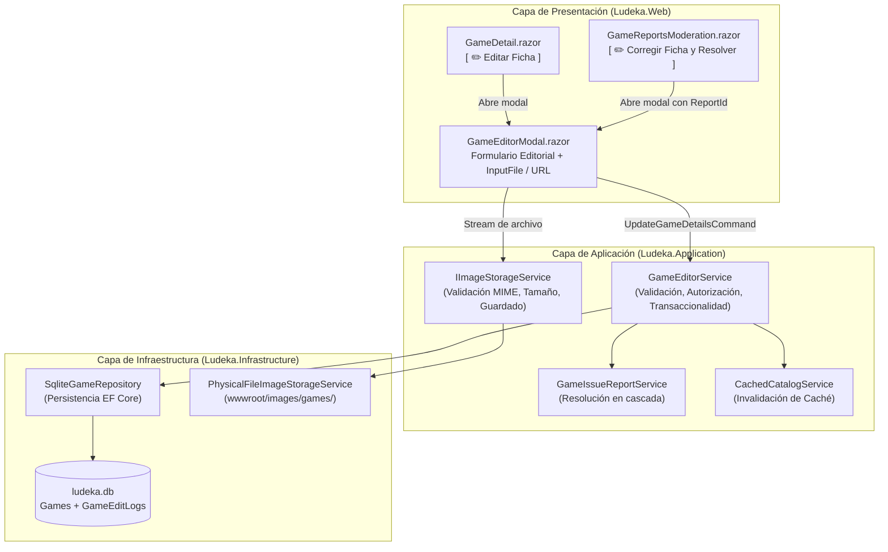

# Propuesta: change-18-moderator-game-editor (Incremento 18: Editor Editorial de Fichas de Catálogo y Carga de Imágenes para Moderadores)

## 1. Resumen Ejecutivo y Motivación

El catálogo de juegos de Ludeka es la columna vertebral de la plataforma. A través del **Incremento 17**, los jugadores y visitantes cuentan con un canal directo para reportar fallos, erratas de edición, duraciones imprecisas o imágenes rotas. Sin embargo, para cerrar el ciclo de excelencia editorial ("*Comunidad reporta ➔ Moderador revisa ➔ Moderador corrige ficha ➔ Reporte resuelto*"), los moderadores necesitan una herramienta operativa ágil que les permita:
1. **Editar metadatos y parámetros de mesa** de cualquier ficha en tiempo real desde la propia ficha o desde la bandeja de incidencias.
2. **Subir y reemplazar imágenes de portada** (vía archivo físico `.jpg`/`.png`/`.webp` o URL remota con previsualización).
3. **Resolver incidencias comunitarias en un solo clic** al guardar las modificaciones, garantizando auditoría, coherencia y actualización inmediata sin parpadeos (Zero-FOUC).

---

## 2. Objetivos Principales

1. **Control de Acceso y Permisos Editoriales:**
   - Restringido estrictamente a moderadores y equipo fundador (`ICurrentUserService.IsFoundingTeam || ICurrentUserService.IsInRole("Moderator")`).
   - Botón contextual `[ ✏️ Editar Ficha ]` visible exclusivamente para roles autorizados en `GameDetail.razor`.
   - Botón `[ ✏️ Corregir Ficha y Resolver ]` en la bandeja de reportes de `GameReportsModeration.razor`.

2. **Formulario Editorial Completo (`GameEditorModal.razor`):**
   - **Metadatos Generales:** Título comercial en español, Título original, Diseñador/Autor, Editorial licenciada y Año de publicación.
   - **Parámetros Técnicos y de Mesa:** Rango de jugadores (mín/máx con ajuste automático de escalabilidad), Duración de partida (mín/máx y minutos estimados por jugador), Edad mínima oficial (caja y comunidad), Dependencia del idioma (`None`, `Low`, `Medium`, `High`), Estilo de juego (`Euro`, `Ameritrash`, `Party`, `Filler`, etc.), Tipo de confrontación (`Competitive`, `Cooperative`, `SemiCooperative`, `TeamVsTeam`) y Espacio en mesa (`TableFootprint`).
   - **Sinopsis y Notas:** Descripción depurada y sinopsis limpia en español.

3. **Gestor de Carga y Reemplazo de Imágenes:**
   - **Subida de Archivos:** Componente Blazor `InputFile` compatible con formatos `.jpg`, `.jpeg`, `.png`, `.webp` con tope de seguridad de 5 MB.
   - **Almacenamiento Físico:** En `src/Ludeka.Web/wwwroot/images/games/` bajo nomenclatura canónica higienizada `{slug}-cover-{timestamp}.{ext}` o `{slug}-cover.{ext}`.
   - **Enlace Remoto Alternativo:** Posibilidad de suministrar una URL externa verificada con vista previa interactiva.
   - **Invalidación Inmediata de Caché:** Purga instantánea en `CachedCatalogService.Invalidate(slug)` y refresco en caliente de la vista activa sin recargas forzadas de página.

4. **Circuito Cerrado de Resolución de Incidencias:**
   - Soporte para asociar un `ReportId` al abrir el modal desde `GameReportsModeration.razor`.
   - Al pulsar `[ Guardar y Resolver ]`, la ficha se actualiza y el reporte pasa automáticamente a estado `Resolved` con la nota del moderador y fecha UTC registrada.

5. **Auditoría Editorial (`GameEditLog`):**
   - Trazabilidad de cada cambio: qué usuario moderó, fecha exacta, resumen de campos alterados e ID del reporte resuelto asociado.

---

## 3. Criterios de Aceptación (Gherkin)

```gherkin
Escenario: Moderador modifica datos erróneos de una ficha existente
  Dado un usuario autenticado con rol "Moderator" o "FoundingTeam"
  Cuando pulsa en "✏️ Editar Ficha" en la ficha del juego "Catan"
  Y modifica el número mínimo de jugadores de 3 a 2 y actualiza la editorial a "Devir"
  Y pulsa "Guardar Cambios"
  Entonces la entidad Game en base de datos SQLite persiste los nuevos valores
  Y la caché del catálogo para ese juego queda invalidada
  Y la vista del juego refleja los cambios al instante sin recarga completa

Escenario: Moderador sube una nueva carátula para sustituir una imagen incorrecta
  Dado un moderador autenticado en la ficha de un juego con carátula de baja resolución
  Cuando abre el modal de edición y selecciona un archivo "caratula_hd.jpg" de 2 MB
  Y pulsa "Subir y Aplicar"
  Entonces el fichero se almacena en "wwwroot/images/games/" con nombre seguro
  Y la propiedad CoverImageUrl del juego se actualiza con la ruta relativa
  Y la ficha muestra la nueva carátula de inmediato

Escenario: Moderador corrige ficha y resuelve reporte comunitario en un clic
  Dado un reporte de incidencia de INC-17 para el juego "Wingspan" indicando "Falta autora"
  Cuando el moderador pulsa "Corregir Ficha y Resolver" desde la bandeja de reportes
  Y añade "Elizabeth Hargrave" en el campo Diseñador y pulsa "Guardar y Resolver Reporte"
  Entonces los datos del juego se actualizan en el catálogo
  Y el reporte de incidencia pasa automáticamente a estado "Resolved" con auditoría
  Y la bandeja de moderación se refresca reflejando el reporte resuelto

Escenario: Usuario no autorizado intenta invocar la edición
  Dado un usuario con rol de comunidad general o visitante no autenticado
  Cuando visualiza la ficha de un juego o la plataforma
  Entonces la interfaz no muestra el botón de edición de ficha
  Y cualquier invocación directa al servicio devuelve excepción o acceso denegado
```

---

## 4. Flujo Operativo y Arquitectura de Componentes



---

## 5. Alcance Funcional Detallado por Capa

- **`Ludeka.Core`:**
  - `Game.cs`: Método de dominio `UpdateCatalogInformation(...)` para actualizar campos atómicamente asegurando invariantes (min <= max jugadores, min <= max duración, año válido) y `UpdateImages(...)`.
  - `GameEditLog.cs`: Entidad para registrar auditoría de cambios editoriales.
- **`Ludeka.Application`:**
  - `IGameEditorService.cs` y `GameEditorService.cs`: Orquesta la actualización, valida permisos de moderación, genera log de auditoría y resuelve el reporte asociado si existe.
  - `IImageStorageService.cs`: Contrato para almacenamiento y validación de imágenes.
  - `GameEditorDtos.cs`: Comandos y DTOs (`UpdateGameDetailsCommand`, `GameImageUploadResult`, `GameEditLogDto`).
- **`Ludeka.Infrastructure`:**
  - `PhysicalFileImageStorageService.cs`: Guarda archivos en el directorio local `wwwroot/images/games/`, valida extensiones `.jpg`, `.jpeg`, `.png`, `.webp` y tamaño máx 5 MB.
  - `SqliteGameRepository.cs`: Actualización del método `UpdateAsync` para persistir cambios completos de la entidad.
  - `LudekaDbContext.cs` y `SqliteSchemaMigrator.cs`: Mapeo de `GameEditLogs` y reconciliación automática de esquema SQLite.
- **`Ludeka.Web`:**
  - `GameEditorModal.razor`: Componente modal con diseño editorial, pestañas limpias de edición (Metadatos, Mesa, Sinopsis, Carátula), validación reactiva y previsualización de imagen en vivo.
  - `GameDetail.razor`: Botón `[ ✏️ Editar Ficha ]` e integración reactiva tras guardar.
  - `GameReportsModeration.razor`: Botón `[ ✏️ Corregir Ficha y Resolver ]` e integración reactiva con refresco de bandeja.
- **`Ludeka.UnitTests`:**
  - Pruebas unitarias de dominio, aplicación, infraestructura y componentes web.
