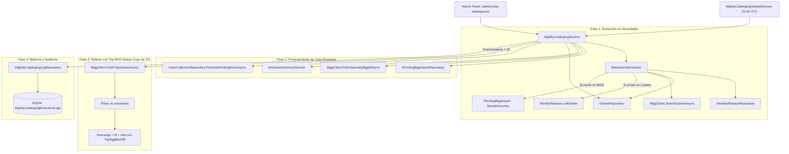

# Diseño Técnico de Arquitectura: change-24-nightly-game-discovery-cataloging

## 1. Diagrama de Flujo y Arquitectura del Pipeline



---

## 2. Definición Detallada de Modelos y Contratos

### 2.1 Dominio (`Ludeka.Core`)

#### `CatalogQueueOrigin.cs`
```csharp
namespace Ludeka.Core.Enums;

public enum CatalogQueueOrigin
{
    UserImport = 0,
    NewsDiscovery = 1,
    TopBggBackfill = 2
}
```

#### `PendingBggImport.cs` (Actualización)
- Propiedades:
  ```csharp
  public CatalogQueueOrigin Origin { get; private set; } = CatalogQueueOrigin.UserImport;
  public string? ExtractedTitle { get; private set; }
  ```
- Constructores:
  - Se añade sobrecarga opcional que admite `origin` y `extractedTitle`.

#### `WeeklyRelease.cs` (Actualización)
- Método de mutación:
  ```csharp
  public void LinkGame(Guid gameId)
  {
      if (gameId == Guid.Empty)
          throw new ArgumentException("El ID del juego vinculado no puede ser Guid.Empty.", nameof(gameId));
      GameId = gameId;
  }
  ```

#### `NightlyCatalogingExecutionLog.cs` (Nueva entidad)
```csharp
namespace Ludeka.Core.Entities;

public class NightlyCatalogingExecutionLog
{
    public Guid Id { get; private set; } = Guid.NewGuid();
    public DateTimeOffset StartedAt { get; private set; } = DateTimeOffset.UtcNow;
    public DateTimeOffset? CompletedAt { get; private set; }
    public int QueueProcessedCount { get; private set; }
    public int NewsDiscoveryCount { get; private set; }
    public int TopBackfillCount { get; private set; }
    public int TotalCatalogedCount { get; private set; }
    public int FailedCount { get; private set; }
    public string CatalogedTitlesJson { get; private set; } = "[]";
    public string Status { get; private set; } = "Running";
    public string? ErrorMessage { get; private set; }

    private NightlyCatalogingExecutionLog() { }

    public NightlyCatalogingExecutionLog(DateTimeOffset startedAt)
    {
        StartedAt = startedAt;
        Status = "Running";
    }

    public void Complete(int queueProcessed, int newsDiscovery, int topBackfill, int totalCataloged, int failed, IEnumerable<string> titles)
    {
        CompletedAt = DateTimeOffset.UtcNow;
        QueueProcessedCount = queueProcessed;
        NewsDiscoveryCount = newsDiscovery;
        TopBackfillCount = topBackfill;
        TotalCatalogedCount = totalCataloged;
        FailedCount = failed;
        CatalogedTitlesJson = System.Text.Json.JsonSerializer.Serialize(titles);
        Status = "Completed";
    }

    public void Fail(string error)
    {
        CompletedAt = DateTimeOffset.UtcNow;
        Status = "Failed";
        ErrorMessage = error;
    }
}
```

---

### 2.2 Aplicación (`Ludeka.Application`)

#### `BggTopGameDto.cs`
```csharp
namespace Ludeka.Application.DTOs;

public record BggTopGameDto(
    int BggId,
    string Title,
    int? BggRank,
    int? YearPublished,
    string? ThumbnailUrl
);
```

#### `NightlyCatalogingDtos.cs`
```csharp
namespace Ludeka.Application.DTOs;

public record NightlyCatalogingOptions
{
    public int DailyCatalogingLimit { get; set; } = 20;
    public double MinDelaySecondsBetweenCalls { get; set; } = 2.5;
    public int ExecutionHourUtc { get; set; } = 3;
    public bool Enabled { get; set; } = true;
}

public record NightlyCatalogingResultDto(
    Guid LogId,
    DateTimeOffset StartedAt,
    DateTimeOffset CompletedAt,
    int QueueProcessedCount,
    int NewsDiscoveryCount,
    int TopBackfillCount,
    int TotalCatalogedCount,
    int FailedCount,
    IReadOnlyList<string> CatalogedTitles,
    string Status,
    string? ErrorMessage
);

public record NightlyCatalogingExecutionLogDto(
    Guid Id,
    DateTimeOffset StartedAt,
    DateTimeOffset? CompletedAt,
    int QueueProcessedCount,
    int NewsDiscoveryCount,
    int TopBackfillCount,
    int TotalCatalogedCount,
    int FailedCount,
    IReadOnlyList<string> CatalogedTitles,
    string Status,
    string? ErrorMessage
);
```

#### `INewsGameExtractor.cs`
```csharp
namespace Ludeka.Application.Contracts;

public interface INewsGameExtractor
{
    string? ExtractGameTitle(string newsTitle, string? newsNotes = null);
    Task<NewsExtractionResultDto> ProcessReleaseAsync(WeeklyRelease release, CancellationToken ct = default);
    Task<int> DiscoverAndEnqueueFromReleasesAsync(CancellationToken ct = default);
}

public record NewsExtractionResultDto(
    Guid ReleaseId,
    string? ExtractedTitle,
    bool LinkedToExistingGame,
    Guid? ExistingGameId,
    bool EnqueuedToBgg,
    int? EnqueuedBggId
);
```

#### `INightlyCatalogingService.cs`
```csharp
namespace Ludeka.Application.Contracts;

public interface INightlyCatalogingService
{
    Task<NightlyCatalogingResultDto> ExecuteNightlyCatalogingAsync(int? customLimit = null, CancellationToken ct = default);
    Task<IReadOnlyList<NightlyCatalogingExecutionLogDto>> GetExecutionHistoryAsync(int limit = 20, CancellationToken ct = default);
    Task<NightlyCatalogingOptions> GetOptionsAsync(CancellationToken ct = default);
}
```

#### `INightlyCatalogingLogRepository.cs`
```csharp
namespace Ludeka.Application.Contracts;

public interface INightlyCatalogingLogRepository
{
    Task AddAsync(NightlyCatalogingExecutionLog log, CancellationToken ct = default);
    Task UpdateAsync(NightlyCatalogingExecutionLog log, CancellationToken ct = default);
    Task<IReadOnlyList<NightlyCatalogingExecutionLog>> GetRecentLogsAsync(int limit = 20, CancellationToken ct = default);
    Task<NightlyCatalogingExecutionLog?> GetLatestLogAsync(CancellationToken ct = default);
}
```

#### `IBggClient.cs` (Extensión)
```csharp
Task<IReadOnlyList<BggTopGameDto>> FetchTopGamesAsync(int limit = 50, CancellationToken ct = default);
```

---

### 2.3 Infraestructura (`Ludeka.Infrastructure`)

1. **`BggSimulationDataset` & `SimulatedBggClient`:**
   - Extraer juegos de `Blueprints` ordenados por `BggRank ?? int.MaxValue`.
2. **`BggXmlApiClient`:**
   - Petición HTTP a `https://boardgamegeek.com/xmlapi2/hot?type=boardgame`.
   - Parseo XML de los elementos `<item id="..." rank="...">` mapeando a `BggTopGameDto`.
3. **`SqliteSchemaMigrator`:**
   - Verificación de columnas `Origin` y `ExtractedTitle` en `PendingBggImports`.
   - Creación de tabla `NightlyCatalogingExecutionLogs` si no existe.
4. **`NightlyCatalogingHostedService`:**
   - Hereda de `BackgroundService`.
   - Revisa periódicamente si la hora actual en UTC coincide con `ExecutionHourUtc` y no se ha ejecutado hoy.

---

### 2.4 Presentación Web (`Ludeka.Web`)

- **Ruta:** `/admin/cola-catalogacion`
- **Página Razor:** `CatalogQueueAdmin.razor`
- **Autorización:** `CurrentUserService.IsFoundingTeam || (CurrentUserService.IsInRole("Moderator") && CurrentUserService.HasPermission(ModeratorPermission.CanEditGames))`
- **Funcionalidades:**
  - Resumen KPI: Cupo diario (20), Juegos en cola, Descubrimientos de novedades, Total en catálogo.
  - Botón: `[ 🌙 Ejecutar Batch Nocturno Ahora ]` (con feedback en vivo y desactivación durante proceso).
  - Filtro por origen: Todos, Usuario, Novedad, Top BGG.
  - Tabla de cola de catalogación con acciones de reintento.
  - Tabla histórica de ejecuciones con estado, juegos catalogados y duración.
