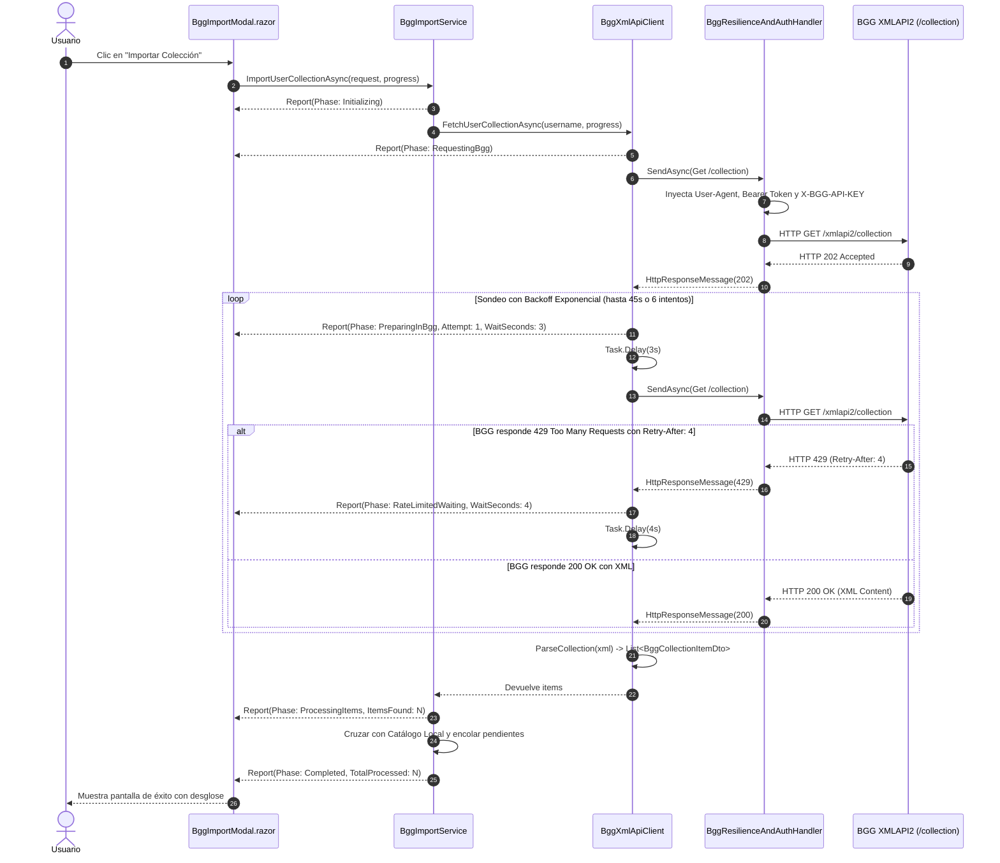

# Documento de Diseño Técnico: change-25-bgg-collection-resilience-token

- **Incremento:** INC-25
- **Módulo:** Integración BGG XMLAPI2, Resiliencia HTTP y Experiencia de Importación

---

## 1. Arquitectura y Flujo de Interacción

El siguiente diagrama muestra el flujo desacoplado entre la UI Blazor, los servicios de aplicación, el cliente HTTP y el pipeline de resiliencia con notificación reactiva de progreso:



---

## 2. Detalle de Componentes por Capas

### 2.1 Dominio y Contratos (`Ludeka.Core` y `Ludeka.Application`)

#### `BggImportPhase` (Enum)
Ubicación: `src/Ludeka.Core/Enums/BggImportPhase.cs`
```csharp
namespace Ludeka.Core.Enums;

public enum BggImportPhase
{
    Initializing = 0,
    RequestingBgg = 1,
    PreparingInBgg = 2,
    RateLimitedWaiting = 3,
    ProcessingItems = 4,
    Completed = 5,
    Failed = 6
}
```

#### `BggImportProgressReport` (Record DTO)
Ubicación: `src/Ludeka.Application/DTOs/BggImportProgressReport.cs`
```csharp
using Ludeka.Core.Enums;

namespace Ludeka.Application.DTOs;

public record BggImportProgressReport(
    BggImportPhase Phase,
    string Message,
    int CurrentAttempt = 0,
    int MaxAttempts = 0,
    int? WaitSeconds = null,
    int ItemsFound = 0
);
```

#### Contrato `IBggClient`
Ubicación: `src/Ludeka.Application/Contracts/IBggClient.cs`
```csharp
public interface IBggClient
{
    Task<Game?> FetchGameByBggIdAsync(int bggId, CancellationToken ct = default);
    Task<IReadOnlyList<BggCollectionItemDto>> FetchUserCollectionAsync(
        string username,
        IProgress<BggImportProgressReport>? progress = null,
        CancellationToken ct = default);
    Task<IReadOnlyList<BggSearchResultDto>> SearchGamesAsync(string query, CancellationToken ct = default);
    Task<IReadOnlyList<BggTopGameDto>> FetchTopGamesAsync(int limit = 50, CancellationToken ct = default);
}
```

#### Contrato `IBggImportService`
Ubicación: `src/Ludeka.Application/Contracts/IBggImportService.cs`
```csharp
public interface IBggImportService
{
    Task<BggImportResultDto> ImportUserCollectionAsync(
        BggImportRequest request,
        IProgress<BggImportProgressReport>? progress = null,
        CancellationToken ct = default);
}
```

---

### 2.2 Infraestructura (`Ludeka.Infrastructure`)

#### `BggOptions`
Ubicación: `src/Ludeka.Infrastructure/Bgg/BggOptions.cs`
```csharp
namespace Ludeka.Infrastructure.Bgg;

public class BggOptions
{
    public const string SectionName = "Bgg";

    public string? ApiKey { get; set; }
    
    private string? _bearerToken;
    public string? BearerToken
    {
        get => _bearerToken ?? ApiToken;
        set => _bearerToken = value;
    }

    public string? ApiToken
    {
        get => _bearerToken;
        set => _bearerToken = value;
    }

    public string BaseUrl { get; set; } = "https://boardgamegeek.com/xmlapi2/";
    public string UserAgent { get; set; } = "LudekaApp/1.0 (https://ludeka.es; contacto@ludeka.es)";
    public bool SimulateApi { get; set; } = true;
    public bool ShouldSimulate => SimulateApi || (string.IsNullOrWhiteSpace(ApiToken) && string.IsNullOrWhiteSpace(ApiKey));

    public int MaxPollingRetries { get; set; } = 6;
    public int PollingTimeoutSeconds { get; set; } = 45;
    public int InitialPollingDelaySeconds { get; set; } = 3;
    public int MaxRateLimitRetries { get; set; } = 3;
}
```

#### `BggResilienceAndAuthHandler` (`DelegatingHandler`)
Ubicación: `src/Ludeka.Infrastructure/Bgg/BggResilienceAndAuthHandler.cs`
- Hereda de `DelegatingHandler`.
- Inyecta cabecera `User-Agent` si no existe en la petición saliente.
- Inyecta cabecera `Authorization: Bearer <token>` si `BearerToken` está presente.
- Inyecta cabecera `X-BGG-API-KEY: <key>` si `ApiKey` está presente.
- Expone un método auxiliar público estático `ExtractRetryAfterSeconds(HttpResponseMessage response)` para reutilización en pruebas y clientes.

#### `BggXmlApiClient`
Ubicación: `src/Ludeka.Infrastructure/Bgg/BggXmlApiClient.cs`
- Incorpora la lógica de sondeo adaptativo con backoff progresivo:
  - Vector de retrasos precalculado: `[3, 5, 8, 12, 15, 15]`.
  - Cronómetro con `Stopwatch` para asegurar que el tiempo total no sobrepasa `PollingTimeoutSeconds`.
  - Reporta en cada ciclo `IProgress<BggImportProgressReport>` para que la UI reaccione inmediatamente.
  - Al recibir `202`: reporta `PreparingInBgg`.
  - Al recibir `429`: extrae `Retry-After` vía `BggResilienceAndAuthHandler.ExtractRetryAfterSeconds(response)`, reporta `RateLimitedWaiting` y aguarda el tiempo prescrito.
  - Al recibir `200`: reporta `ProcessingItems` y parsea el XML.

#### `SimulatedBggClient`
Ubicación: `src/Ludeka.Infrastructure/Bgg/SimulatedBggClient.cs`
- Implementa la nueva firma con `IProgress<BggImportProgressReport>? progress = null`.
- Emite un progreso rápido no bloqueante para verificar en pruebas de UI que el enlace de eventos funciona.

---

### 2.3 Presentación (`Ludeka.Web`)

#### `BggImportModal.razor`
- Inyecta `Progress<BggImportProgressReport>`.
- Reemplaza el texto estático por una tarjeta de estado en vivo:
  - **Fase `PreparingInBgg`:** Animación de reloj de arena / dados rodando, título *"BGG está preparando tu colección..."* y texto secundario con el número de intento actual.
  - **Fase `RateLimitedWaiting`:** Caja de alerta ámbar con icono de calma ⏳: *"BGG está saturado temporalmente (Rate Limit). Pausando X segundos antes de reintentar..."*
  - **Fase `ProcessingItems`:** Barra de progreso con porcentaje activo y texto *"Procesando X juegos encontrados en tu ludoteca..."*
- Garantiza accesibilidad con `role="status"` y atributos ARIA actualizados en cada paso.

---

## 3. Plan de Pruebas Unitarias

1. **`BggResilienceAndAuthHandlerTests` / `BggXmlApiClientResilienceTests`:**
   - Envío con cabeceras Bearer y ApiKey: verificar presencia en la petición recibida por el handler simulado.
   - Envío sin cabeceras: verificar presencia de User-Agent por defecto.
   - Simulación 202 -> 202 -> 200: comprobar 3 intentos, emisión de progreso con `PreparingInBgg` y retorno exitoso de ítems.
   - Simulación 429 con `Retry-After: 2` -> 200: comprobar detección de 2s, reporte `RateLimitedWaiting` y reintento exitoso.
   - Simulación 202 persistente hasta timeout: verificar finalización amigable sin excepciones no controladas.
2. **`BggImportServiceProgressTests`:**
   - Validar que `ImportUserCollectionAsync` emite correctamente las fases de inicio, preparación y finalización con el recuento adecuado de juegos importados y encolados.
3. **`BggOptionsTests`:**
   - Validar la sincronización entre `ApiToken` y `BearerToken`, los valores por defecto de resiliencia y el comportamiento de `ShouldSimulate`.
