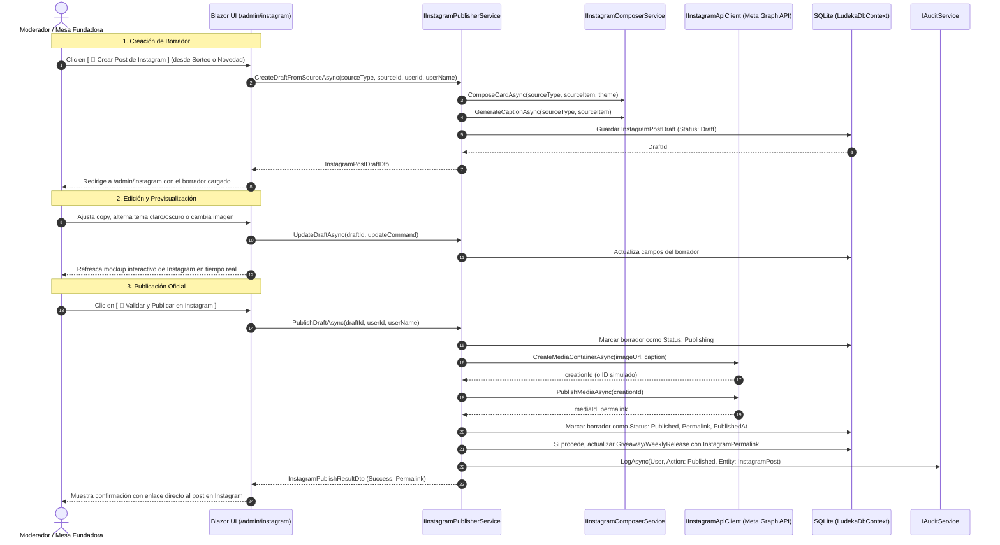

# Diseño Técnico y Arquitectura: change-28-instagram-direct-publisher

## 1. Diagrama de Arquitectura y Flujo



---

## 2. Modelos de Dominio (`Ludeka.Core`)

### 2.1 Enums Lúdicos y de Estado
```csharp
namespace Ludeka.Core.Enums;

public enum InstagramPostSourceType
{
    Giveaway,
    WeeklyRelease,
    Game,
    Manual
}

public enum InstagramPostDraftStatus
{
    Draft,
    Publishing,
    Published,
    Failed
}
```

### 2.2 Entidad `InstagramPostDraft`
```csharp
namespace Ludeka.Core.Entities;

public class InstagramPostDraft
{
    public Guid Id { get; private set; } = Guid.NewGuid();
    public InstagramPostSourceType SourceType { get; private set; }
    public string SourceId { get; private set; } = string.Empty;
    public string Title { get; private set; } = string.Empty;
    public string Caption { get; private set; } = string.Empty;
    public string? ImageUrl { get; private set; }
    public string? SvgContent { get; private set; }
    public string Theme { get; private set; } = "Dark"; // "Dark" | "Light"
    public InstagramPostDraftStatus Status { get; private set; } = InstagramPostDraftStatus.Draft;
    public string? InstagramMediaId { get; private set; }
    public string? InstagramPermalink { get; private set; }
    public string? ErrorMessage { get; private set; }
    public string CreatedByUserId { get; private set; } = string.Empty;
    public string CreatedByUserName { get; private set; } = string.Empty;
    public DateTimeOffset CreatedAt { get; private set; } = DateTimeOffset.UtcNow;
    public DateTimeOffset? PublishedAt { get; private set; }
    public DateTimeOffset? UpdatedAt { get; private set; }

    // Métodos de mutación de dominio:
    // UpdateDraft(caption, theme, imageUrl, svgContent)
    // MarkPublishing()
    // MarkPublished(mediaId, permalink)
    // MarkFailed(errorMessage)
}
```

### 2.3 Actualización de Entidades Existentes
- **`Giveaway`**: Añadir propiedades `InstagramMediaId`, `InstagramPermalink`, método `MarkPublishedOnInstagram(string mediaId, string permalink)` y propiedad calculada `bool IsPublishedOnInstagram => !string.IsNullOrWhiteSpace(InstagramPermalink);`.
- **`WeeklyRelease`**: Añadir propiedades `InstagramMediaId`, `InstagramPermalink`, método `MarkPublishedOnInstagram(string mediaId, string permalink)` y propiedad calculada `bool IsPublishedOnInstagram => !string.IsNullOrWhiteSpace(InstagramPermalink);`.
- **`ModeratorPermission`**: Añadir `CanPublishInstagram = 1 << 7` (128) y actualizar `All`.
- **`AuditEntityType`**: Añadir `InstagramPost`.

---

## 3. Capa de Aplicación (`Ludeka.Application`)

### 3.1 DTOs
- `InstagramPostDraftDto`: proyección inmutable con todas las propiedades de visualización.
- `UpdateInstagramDraftCommand`: para modificar copy, tema visual y URL de imagen.
- `InstagramPublishResultDto`: `bool Success`, `string? Permalink`, `string? MediaId`, `string? ErrorMessage`.
- `InstagramCardOptionsDto`: opciones para renderizar la tarjeta (`Theme`, `ShowBadges`, `CustomBadgeText`).

### 3.2 Interfaces de Casos de Uso
- **`IInstagramComposerService`**:
  - `string ComposeSvg(InstagramPostSourceType sourceType, object sourceEntity, string theme = "Dark")`: genera el SVG 1:1 cuadrado.
  - `string GenerateCaption(InstagramPostSourceType sourceType, object sourceEntity)`: genera el texto con emojis, organizador/editorial, fechas y hashtags.
- **`IInstagramPublisherService`**:
  - `Task<InstagramPostDraftDto> CreateDraftFromGiveawayAsync(Guid giveawayId, string userId, string userName, CancellationToken ct = default)`
  - `Task<InstagramPostDraftDto> CreateDraftFromWeeklyReleaseAsync(Guid releaseId, string userId, string userName, CancellationToken ct = default)`
  - `Task<InstagramPostDraftDto> CreateDraftFromGameAsync(Guid gameId, string userId, string userName, CancellationToken ct = default)`
  - `Task<InstagramPostDraftDto?> GetDraftByIdAsync(Guid draftId, CancellationToken ct = default)`
  - `Task<IReadOnlyList<InstagramPostDraftDto>> GetDraftsAsync(InstagramPostDraftStatus? status = null, CancellationToken ct = default)`
  - `Task<InstagramPostDraftDto> UpdateDraftAsync(Guid draftId, UpdateInstagramDraftCommand command, CancellationToken ct = default)`
  - `Task<InstagramPublishResultDto> PublishDraftAsync(Guid draftId, string userId, string userName, CancellationToken ct = default)`
  - `Task<bool> DeleteDraftAsync(Guid draftId, CancellationToken ct = default)`
- **`IInstagramApiClient`**:
  - `Task<string> CreateMediaContainerAsync(string imageUrl, string caption, CancellationToken ct = default)`
  - `Task<string> PublishMediaAsync(string creationId, CancellationToken ct = default)`
  - `Task<string?> GetPermalinkAsync(string mediaId, CancellationToken ct = default)`

---

## 4. Capa de Infraestructura (`Ludeka.Infrastructure`)

### 4.1 Configuración (`InstagramSettings`)
```json
"Instagram": {
  "Simulate": true,
  "AccessToken": "",
  "InstagramAccountId": "",
  "BaseUrl": "https://graph.facebook.com/v19.0/",
  "PublicBaseUrl": "https://ludeka.es"
}
```

### 4.2 Cliente HTTP (`InstagramApiClient`)
- Implementa `IInstagramApiClient` usando `HttpClient`.
- En modo `Simulate = true` o si `AccessToken` está vacío, devuelve respuestas simuladas instantáneas con IDs reproducibles (`sim_creation_...`, `sim_media_...`, `https://www.instagram.com/p/sim_...`).
- En modo real, ejecuta las llamadas REST contra la Meta Graph API v19.0 gestionando códigos de error comunes (400, 401 token caducado, 403 cuotas).

### 4.3 Persistencia y Migraciones
- `LudekaDbContext`: añadir `DbSet<InstagramPostDraft> InstagramPostDrafts`.
- `SqliteSchemaMigrator`: creación de tabla `InstagramPostDrafts` y migración de columnas `InstagramMediaId` e `InstagramPermalink` en `Giveaways` y `WeeklyReleases`.

---

## 5. Capa Web Blazor (`Ludeka.Web`)

### 5.1 Endpoint Minimal API para Tarjetas
- `GET /api/instagram/card/{draftId}.svg`: devuelve el contenido SVG del borrador con cabecera `Content-Type: image/svg+xml; charset=utf-8` y caché controlada.

### 5.2 Componentes UI
- **`InstagramModeration.razor` (`@page "/admin/instagram"`):**
  - Cabecera con estadísticas de publicaciones y estado de conexión (Simulado / Producción).
  - Selector de borrador activo con lista de borradores pendientes / publicados.
  - **Mockup de Instagram:** Carcasa visual del feed con cabecera `@ludeka.app`, imagen 1:1, botones de interacción y copy.
  - **Panel de edición:** Conmutador de tema Claro/Oscuro, selección de carátula o composición vectorial, textarea para el copy y chips de hashtags.
  - **Botón de acción:** `[ 🚀 Validar y Publicar en Instagram ]` con feedback visual, animación de carga y enlace permanente.
- **`GiveawayCard.razor`:**
  - Botón `[ 📸 Crear Post de Instagram ]` para moderadores con permiso.
  - Badge `[ 📸 Publicado en Instagram ]` con enlace permanente si ya fue publicado.
- **`News.razor`:**
  - Botón `[ 📸 Instagram ]` para moderadores y badge si ya fue publicado.
- **`UserPermissionsModal.razor`:**
  - Checkbox para el nuevo permiso `CanPublishInstagram` ("Publicar en Instagram Oficial").
