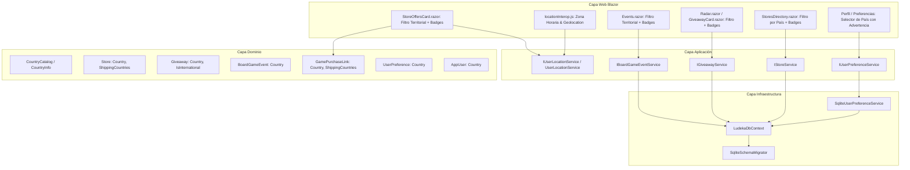

# Diseño Técnico y Arquitectura: change-29-country-location-filtering

## 1. Diagrama de Arquitectura y Flujo



---

## 2. Modelos de Dominio (`Ludeka.Core`)

### 2.1 Value Object `CountryInfo` y Catálogo `CountryCatalog`
```csharp
namespace Ludeka.Core.ValueObjects;

public record CountryInfo(string Code, string Name, string FlagEmoji);

public static class CountryCatalog
{
    public static readonly CountryInfo Spain = new("ES", "España", "🇪🇸");
    public static readonly CountryInfo Mexico = new("MX", "México", "🇲🇽");
    public static readonly CountryInfo Argentina = new("AR", "Argentina", "🇦🇷");
    public static readonly CountryInfo Chile = new("CL", "Chile", "🇨🇱");
    public static readonly CountryInfo Colombia = new("CO", "Colombia", "🇨🇴");
    public static readonly CountryInfo Peru = new("PE", "Perú", "🇵🇪");
    public static readonly CountryInfo Uruguay = new("UY", "Uruguay", "🇺🇾");
    public static readonly CountryInfo International = new("INT", "Internacional", "🌎");

    public static IReadOnlyList<CountryInfo> All { get; } = ...;
    public static CountryInfo? FindByNameOrCode(string? query);
    public static string GetFlag(string? countryName);
}
```

### 2.2 Entidad `Store`
- `public string Country { get; private set; } = "España";`
- `public List<string> ShippingCountries { get; private set; } = [];`
- Métodos de actualización con país y lista de países a los que realiza envíos.

### 2.3 Entidad `Giveaway`
- `public string Country { get; private set; } = "España";`
- Propiedad helper `public bool IsInternational => string.Equals(Country, "Internacional", StringComparison.OrdinalIgnoreCase);`

### 2.4 Entidad `BoardGameEvent`
- `public string Country { get; private set; } = "España";`
- Mantener `Location` para recinto/ciudad y `Country` para el país.

### 2.5 Value Object `GamePurchaseLink`
- `public string Country { get; init; } = "España";`
- `public IReadOnlyList<string>? ShippingCountries { get; init; }`
- Método helper: `public bool ShipsTo(string? targetCountry);`

### 2.6 `UserPreference` y `AppUser`
- `public string? Country { get; private set; }`
- Métodos `SetCountry(string? country)`.

---

## 3. Capa de Aplicación (`Ludeka.Application`)

### 3.1 DTOs
- `UserPreferenceDto(string UserId, string PreferredTheme, string? Country, DateTime UpdatedAt);`
- `StoreDto`, `CreateStoreDto`, `UpdateStoreDto`: campos `Country` y `ShippingCountries`.
- `GiveawayDto`, `CreateGiveawayDto`: campo `Country`.
- `BoardGameEventDto`, `CreateBoardGameEventDto`, `UpdateBoardGameEventDto`: campo `Country`.

### 3.2 Servicio de Ubicación (`IUserLocationService`)
```csharp
namespace Ludeka.Application.Contracts;

public interface IUserLocationService
{
    string? CurrentUserCountry { get; }
    void SetUserCountry(string? country);
    Task<string?> DetectCountryFromClientAsync();
    IEnumerable<T> PrioritizeByCountry<T>(IEnumerable<T> items, Func<T, string> countrySelector);
}
```

---

## 4. Persistencia y Migraciones (`Ludeka.Infrastructure`)

### 4.1 Reconciliación en `SqliteSchemaMigrator`
- Verificar y añadir columna `Country` en `Stores`, `Giveaways`, `BoardGameEvents`, `AppUsers`, `UserPreferences`.
- Añadir columna `ShippingCountries` JSON en `Stores`.
- Crear índices en SQLite: `IX_Stores_Country`, `IX_Giveaways_Country`, `IX_BoardGameEvents_Country`.

### 4.2 Configuración EF Core en `LudekaDbContext`
- Mapeos de columnas, longitudes máximas y `ToJson()` para `ShippingCountries`.

---

## 5. Componentes de Presentación Blazor (`Ludeka.Web`)

1. **`StoreOffersCard.razor`:**
   - Detecta si hay un país activo (por preferencia de usuario o contexto).
   - Filtra la lista de ofertas comprobando `offer.ShipsTo(activeCountry)`.
   - Muestra badge de bandera + país en cada tarjeta de tienda.
   - Si la lista filtrada queda vacía y el usuario tiene país seleccionado, muestra el estado vacío:
     *"Actualmente no disponemos de tiendas colaboradoras con envíos a {país} para este juego o sus fundas."*
2. **`GiveawayCard.razor` y `Radar.razor`:**
   - Badge visual de país (ej. "🇪🇸 España" o "🌎 Internacional").
   - Filtrado: muestra sorteos de su país + internacionales.
3. **`Events.razor`:**
   - Badge visual de país en cada cita del calendario.
   - Filtro desplegable por país con conteo reactivo.
4. **`StoresDirectory.razor`:**
   - Filtro desplegable por país con badge en cada tienda.
5. **Configuración de Perfil (`MyLibrary.razor` / Modal de Preferencias):**
   - Selector desplegable de países (con banderas).
   - Componente visual de aviso que se muestra al seleccionar un país:
     > *"⚠️ Al seleccionar un país, los sorteos, eventos y tiendas se filtrarán automáticamente para mostrar únicamente los disponibles en tu territorio. Si prefieres ver toda la información de la comunidad global sin filtrar, déjalo sin seleccionar."*
6. **`locationInterop.js`:**
   - Función JavaScript para leer la zona horaria del cliente y mapearla al país aproximado o invocar `navigator.geolocation` previa confirmación del usuario.
