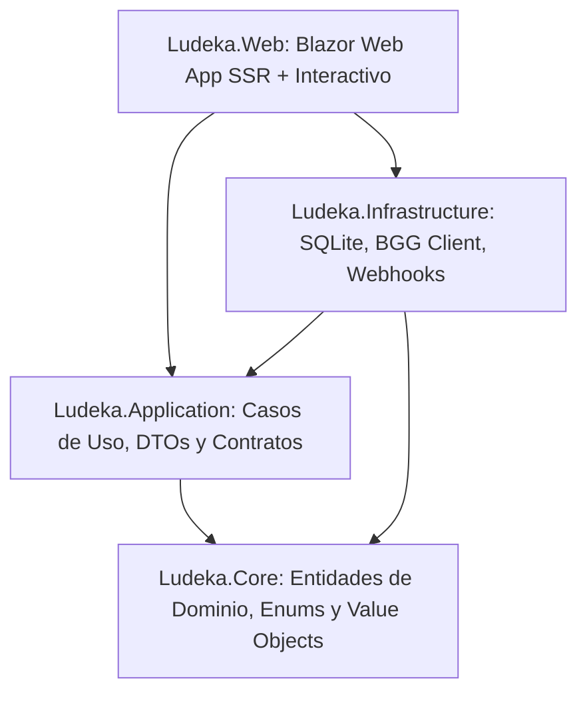

# 📖 Ludeka — Especificación Viva del Sistema (Fuente de la Verdad)

> **Principio de Verdad Absoluta:** Este directorio contiene la documentación técnica y funcional de lo que **realmente existe y está implementado en el código fuente**.  
> Lo que figura en esta especificación está en el código, y lo que está en el código se refleja en esta especificación.  
> Cada vez que un incremento finaliza su ciclo SDD y se traslada a `docs/increments/archive/`, nutre e interactúa con esta especificación viva.

---

## 🏛️ Arquitectura General de la Solución

Ludeka está construido sobre **.NET 10 (C# 13)** adoptando principios de **Clean Architecture** y **Vertical Slices**:

- **`src/Ludeka.Core`:** Entidades puras sin dependencias externas (`Game`, `UserCollectionItem`, `FoundingVerdict`, `MediaItem`, `Giveaway`, etc.).
- **`src/Ludeka.Application`:** Contratos (`IGameRepository`, `IBggClient`, `IExpansionService`), servicios de aplicación, DTOs y lógica de negocio.
- **`src/Ludeka.Infrastructure`:** Persistencia SQLite con EF Core, reconciliación automática de esquema (`SqliteSchemaMigrator`), cliente HTTP BGG XMLAPI2, webhooks de Discord/Telegram y semillado (`CatalogSeeder`).
- **`src/Ludeka.Web`:** Interfaz Blazor Web App interactiva con Tailwind CSS, renderizado híbrido (SSR + InteractiveServer), Output Caching y componentes accesibles WCAG 2.2 AA.
- **`tests/Ludeka.UnitTests`:** Suite completa de pruebas unitarias xUnit (723 pruebas pasando al 100%).

---

## 📂 Módulos de la Especificación del Sistema

1. [**01. Catálogo y Ficha Inteligente**](file:///c:/repos/Ludeka/docs/specs/sistema/01-catalogo-y-fichas.md): Agregado `Game`, ADN Lúdico, Semáforo de Escalabilidad, Guía de Fundas, Enlaces de Compra y Caché de 2 Niveles.
2. [**02. Ludoteca Personal y Préstamos**](file:///c:/repos/Ludeka/docs/specs/sistema/02-ludoteca-y-prestamos.md): Colección en 4 estados, Módulo de Préstamos, Formulario de Valoración Rápida y Votación por Comensales.
3. [**03. Mesa Fundadora y Veredictos**](file:///c:/repos/Ludeka/docs/specs/sistema/03-mesa-fundadora.md): Análisis oficial de la casa, Foco en parejas y niños, Galería de fotos reales de mesa y Sellos editoriales.
4. [**04. Hub Multimedia**](file:///c:/repos/Ludeka/docs/specs/sistema/04-hub-multimedia.md): 4 formatos segregados (Vistazo Rápido, Tutoriales, Partidas, Redes y Reseñas), Reproductor accesible, Categorización editorial asistida por heurística semántica, Moderación directa desde la ficha y Reasignación asistida.
5. [**05. Integración BGG**](file:///c:/repos/Ludeka/docs/specs/sistema/05-integracion-bgg.md): Importador en 1 clic, Resiliencia HTTP (sondeo 202 con backoff, Retry-After 429), DelegatingHandler con Bearer/ApiKey, Cola comunitaria de auto-catalogación, Promoción atómica, Buscador asistido y Feedback interactivo en vivo.
6. [**06. Comunidad, Sorteos y Reglas Q&A**](file:///c:/repos/Ludeka/docs/specs/sistema/06-comunidad-sorteos-y-qa.md): Radar de Sorteos con expiración, Novedades de viernes, Consultorio de Reglas estilo StackOverflow y Tarjetas de marca 1:1.
7. [**07. Expansiones y Mezclador de Mesa**](file:///c:/repos/Ludeka/docs/specs/sistema/07-expansiones-y-mezclador.md): Modelo polimórfico en `Game`, Matriz de sinergias par-a-par, Recetas prediseñadas y Mezclador interactivo con detección de sobrecarga.
8. [**08. Notificaciones y Webhooks**](file:///c:/repos/Ludeka/docs/specs/sistema/08-notificaciones-y-webhooks.md): Patrón Outbox asíncrono en segundo plano (`Channel<T>`), Integración con Discord y Telegram, y Alertas automáticas.
9. [**09. Arquitectura y Despliegue**](file:///c:/repos/Ludeka/docs/specs/sistema/09-arquitectura-y-despliegue.md): Persistencia SQLite con auto-migración, Dockerfile multi-stage seguro (no-root), Docker Compose (dev/staging/prod) y Health Checks de diagnóstico.
10. [**10. Síntesis Inteligente con IA**](file:///c:/repos/Ludeka/docs/specs/sistema/10-sintesis-ia.md): Resúmenes estructurados con Google Gemini y heurística desacoplada.
11. [**11. Reportes Comunitarios y Moderación de Fichas**](file:///c:/repos/Ludeka/docs/specs/sistema/11-reportes-y-moderacion-comunitaria.md): Canal de reporte en 2 clics para la comunidad, 8 tipologías de fallo y bandeja de triaje y moderación rápida (`/moderacion/reportes`).
12. [**12. Editor Editorial de Fichas y Carga de Imágenes**](file:///c:/repos/Ludeka/docs/specs/sistema/12-editor-editorial-y-imagenes.md): Edición integral de catálogo y parámetros de mesa, subida y validación física de imágenes, resolución en 1 clic de incidencias y auditoría editorial.
13. [**13. Directorio de Editoriales, Creadores y Tiendas con Redes y Foco Multimedia**](file:///c:/repos/Ludeka/docs/specs/sistema/13-directorio-editoriales-creadores-tiendas.md): Directorio integral de la industria y la comunidad en español, navegación cruzada con catálogo y ofertas, y padrón dinámico de canales para el motor de YouTube.
14. [**14. Gestión de Usuarios, Permisos Granulares y Auditoría Editorial**](file:///c:/repos/Ludeka/docs/specs/sistema/14-gestion-usuarios-permisos-y-auditoria.md): Panel de administración exclusivo para la Mesa Fundadora, roles RBAC, flags bitwise de permisos de moderación, defensa reactiva en cascada y bitácora de auditoría con diff de campos.
15. [**15. Dashboard de Inicio Editorial, Desacople de Catálogo y Enlace Canónico BGG**](file:///c:/repos/Ludeka/docs/specs/sistema/15-dashboard-inicio-editorial.md): Portada editorial con 4 carriles en scroll horizontal táctil (*mobile-first*), desacople de catálogo a `/catalogo`, limpieza de cabecera superior y enlace canónico directo a BoardGameGeek.
16. [**16. Sorteos, Novedades y Grandes Eventos Lúdicos**](file:///c:/repos/Ludeka/docs/specs/sistema/16-sorteos-novedades-y-eventos.md): Segregación de Radar en 3 verticales (`/sorteos`, `/novedades`, `/eventos`), gestión y orden prioritario de sorteos promocionados (`IsPromoted`), alta de novedades editoriales y panel de administración de macro-eventos y ferias lúdicas con subida de carteles.
17. [**17. Localización Geográfica por País, Filtrado Territorial y Detección de Ubicación**](file:///c:/repos/Ludeka/docs/specs/sistema/17-localizacion-territorial-pais.md): Atribución territorial universal (tiendas, sorteos, eventos, enlaces de compra, fundas y usuarios), advertencia explícita obligatoria de filtrado, regla de visibilidad internacional, envíos multipaís, detección por zona horaria de navegador y ordenación prioritaria lúdica.
18. [**18. Detección Automática de Juegos en Novedades y Cola Nocturna Inteligente BGG/Gemini**](file:///c:/repos/Ludeka/docs/specs/sistema/18-deteccion-novedades-y-cola-nocturna.md): Extracción sintáctica y semántica de títulos en publicaciones editoriales (`WeeklyRelease`), vinculación retrospectiva, ingesta nocturna controlada con límite de 20 juegos diarios, relleno de cupo con el Top mundial de BGG, respeto estricto de cuotas (pausa 2.5s) y panel administrativo `/admin/cola-catalogacion`.
19. [**19. Especificación de Fundas (Sleeves) por Juego y Enlaces de Compra Contextuales**](file:///c:/repos/Ludeka/docs/specs/sistema/19-especificacion-fundas-y-enlaces-tiendas.md): Medidas milimétricas exactas, cálculo dual de paquetes (50 y 100), silueta proporcional de carta, comparativa didáctica de micras (50-60µm vs 100µm), catálogo universal `StandardSleeveCatalog`, resolvedor de enlaces quirúrgicos a Zacatrus y socios con tags de afiliado y país, ingesta BGG XML y gestión editorial en `GameEditorModal`.
20. [**20. Verificación de Stock en Tiempo Real en Enlaces de Compra**](file:///c:/repos/Ludeka/docs/specs/sistema/20-verificacion-stock-tiempo-real-tiendas.md): Arquitectura de carga asíncrona diferida con latencia cero en SSR, límite de tiempo estricto (timeout 1.5s), caché L1 en memoria con TTL diferenciado (30m éxito / 5m error), taxonomía semántica de disponibilidad (`InStock`, `LowStock`, `OutOfStock`, `Unknown`), parser de microdatos Schema.org/OpenGraph, cliente de simulación determinista y badges visuales anti-frustración con botón atenuado ante producto agotado.
21. [**21. Generador y Publicador Directo de Posts para Instagram en Moderación**](file:///c:/repos/Ludeka/docs/specs/sistema/21-publicador-directo-instagram.md): Generador de borradores editoriales para Instagram desde sorteos, novedades semanales y fichas de juegos; compositor de tarjetas de marca 1:1 en SVG de alta resolución con soporte de temas Oscuro y Claro; previsualizador de feed en vivo en `/admin/instagram`; publicación directa mediante Meta Graph API v19.0 (con modo simulado automático para desarrollo); gobernanza RBAC con permiso `CanPublishInstagram`, sincronización bidireccional y registro inmutable en auditoría.
22. [**22. Portada Minimalista y Directorio de Creadores de Contenido**](file:///c:/repos/Ludeka/docs/specs/sistema/22-portada-y-directorio-creadores.md): Hero minimalista de portada (h1 `sr-only` accesible, buscador rápido y 4 píldoras de acceso con bugfix del enlace de novedades), página de sorteos sin banner legacy con alias silencioso `/radar`, directorio de creadores de contenido con sembrado purgado y re-siembra desde el padrón estático de canales, fichas con redes sociales sin sección "Obras", diseñador de juego como texto plano, alias `/autores` operativo y reetiquetado transversal Autores → Creadores.
