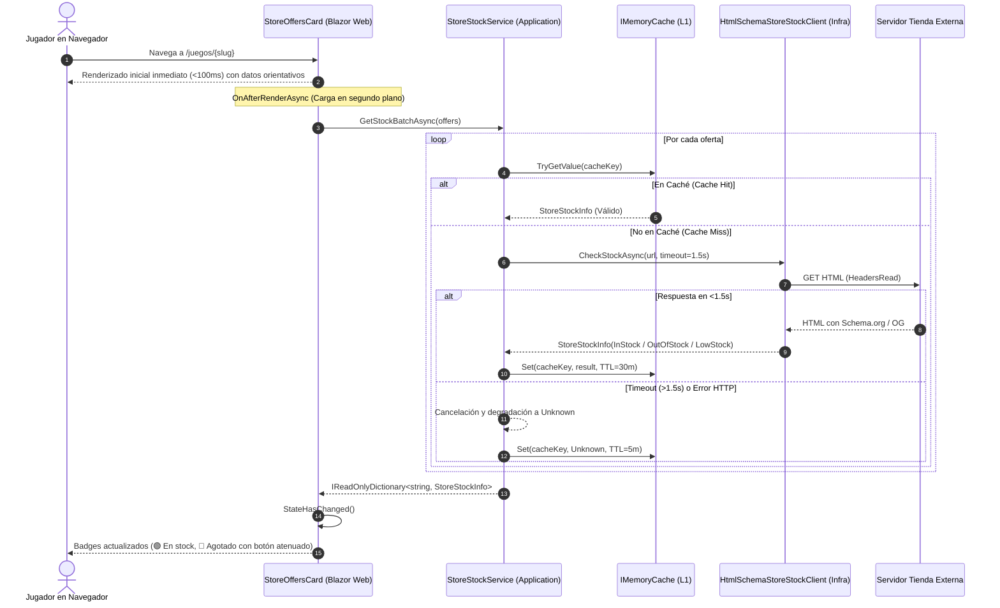

# Documento de Diseño: change-27-store-live-stock-check (Incremento 27)

## 1. Visión Arquitectónica y Filosofía Técnica

El módulo de verificación de stock en tiempo real se implementa sobre los principios fundamentales de Ludeka:
- **Clean Architecture:** Capas desacopladas (Dominio puro sin dependencias externas, Casos de uso con abstracciones de servicio y cliente, Infraestructura con HTTP/Scraping resiliente y Web con Blazor interactivo).
- **Cero Impacto en SSR (Non-blocking by design):** El tiempo de renderizado de la ficha de juego (`GameDetail.razor`) se mantiene por debajo de 100ms. La consulta a tiendas externas se pospone asíncronamente a `OnAfterRenderAsync` en Blazor, actualizando el DOM mediante StateHasChanged de forma reactiva.
- **Resiliencia Extrema (Fail-Safe):** Timeout estricto de 1.500 ms con `CancellationTokenSource`, aislamiento de excepciones de red/scraping y fallback transparente a `StockStatus.Unknown`.
- **Protección de Infraestructura mediante Caché L1:** Uso de `IMemoryCache` con TTL diferenciado (30 min para comprobaciones exitosas, 5 min para fallos/timeouts), impidiendo ráfagas de consultas a tiendas asociadas.

---

## 2. Diagrama de Flujo y Secuencia



---

## 3. Modelo de Dominio (`Ludeka.Core`)

### 3.1 `StockStatus` (`Ludeka.Core.Enums`)
```csharp
namespace Ludeka.Core.Enums;

public enum StockStatus
{
    Unknown = 0,
    InStock = 1,
    LowStock = 2,
    OutOfStock = 3
}
```

### 3.2 `StoreStockInfo` (`Ludeka.Core.ValueObjects`)
```csharp
namespace Ludeka.Core.ValueObjects;

public record StoreStockInfo
{
    public StockStatus Status { get; init; } = StockStatus.Unknown;
    public int? AvailableQuantity { get; init; }
    public decimal? CurrentPrice { get; init; }
    public DateTime? LastCheckedUtc { get; init; }
    public string? StatusNote { get; init; }
    public bool IsChecking { get; init; }

    public bool IsInStock => Status == StockStatus.InStock;
    public bool IsLowStock => Status == StockStatus.LowStock;
    public bool IsOutOfStock => Status == StockStatus.OutOfStock;
    public bool IsUnknown => Status == StockStatus.Unknown;

    public static StoreStockInfo Checking() => new() { IsChecking = true };

    public static StoreStockInfo InStock(int? quantity = null, decimal? price = null, string? note = null) =>
        new() { Status = StockStatus.InStock, AvailableQuantity = quantity, CurrentPrice = price, LastCheckedUtc = DateTime.UtcNow, StatusNote = note };

    public static StoreStockInfo LowStock(int? quantity = null, decimal? price = null, string? note = null) =>
        new() { Status = StockStatus.LowStock, AvailableQuantity = quantity, CurrentPrice = price, LastCheckedUtc = DateTime.UtcNow, StatusNote = note };

    public static StoreStockInfo OutOfStock(string? note = null) =>
        new() { Status = StockStatus.OutOfStock, LastCheckedUtc = DateTime.UtcNow, StatusNote = note };

    public static StoreStockInfo Unknown(string? note = null) =>
        new() { Status = StockStatus.Unknown, LastCheckedUtc = DateTime.UtcNow, StatusNote = note };

    public string GetRelativeTimeText(DateTime? nowUtc = null)
    {
        if (!LastCheckedUtc.HasValue) return "Sin comprobar";
        var now = nowUtc ?? DateTime.UtcNow;
        var diff = now - LastCheckedUtc.Value;
        if (diff.TotalSeconds < 60) return "Comprobado hace instantes";
        if (diff.TotalMinutes < 60) return $"Comprobado hace {(int)diff.TotalMinutes} min";
        if (diff.TotalHours < 24) return $"Comprobado hace {(int)diff.TotalHours} h";
        return $"Comprobado el {LastCheckedUtc.Value:dd/MM}";
    }
}
```

---

## 4. Casos de Uso y Orquestación (`Ludeka.Application`)

### 4.1 Contratos de Servicio y Clientes
```csharp
namespace Ludeka.Application.Contracts;

public interface IStoreStockClient
{
    int Priority { get; }
    bool CanHandle(string storeName, string affiliateUrl);
    Task<StoreStockInfo> CheckStockAsync(string storeName, string affiliateUrl, CancellationToken cancellationToken = default);
}

public interface IStoreStockService
{
    ValueTask<StoreStockInfo> GetStockAsync(string storeName, string affiliateUrl, CancellationToken cancellationToken = default);
    ValueTask<IReadOnlyDictionary<string, StoreStockInfo>> GetStockBatchAsync(IEnumerable<GamePurchaseLink> offers, CancellationToken cancellationToken = default);
    void InvalidateStockCache(string affiliateUrl);
}
```

### 4.2 Opciones de Configuración
```csharp
namespace Ludeka.Application.Options;

public class StoreStockOptions
{
    public const string SectionName = "StoreStock";
    public int DefaultTtlMinutes { get; set; } = 30;
    public int ErrorTtlMinutes { get; set; } = 5;
    public int TimeoutMilliseconds { get; set; } = 1500;
    public bool EnableLiveChecking { get; set; } = true;
    public bool EnableSimulation { get; set; } = false;
}
```

---

## 5. Implementación de Infraestructura (`Ludeka.Infrastructure`)

### 5.1 `HtmlSchemaStoreStockClient`
- Inspección de microdatos Schema.org:
  - `itemprop="availability" href="https://schema.org/InStock"`
  - `itemprop="availability" href="https://schema.org/OutOfStock"`
  - JSON-LD `"availability": "https://schema.org/InStock"`
- Inspección de OpenGraph:
  - `<meta property="og:availability" content="instock" />`
  - `<meta property="product:availability" content="in stock" />`
- Patrones léxicos de tiendas en español para mayor cobertura:
  - `agotado`, `sin existencias`, `temporalmente fuera de stock` -> `OutOfStock`
  - `últimas unidades`, `pocas unidades` -> `LowStock`
  - `en stock`, `disponible de inmediato`, `añadir a la cesta` -> `InStock`

### 5.2 `SimulationStoreStockClient`
- Simula estados de stock basados en reglas deterministas (por ejemplo, palabras clave en la URL como "agotado", "ultimas", "timeout" o "error") para testing de integración y entornos desconectados.

---

## 6. Interfaz de Usuario (`Ludeka.Web`)

### Componente `StoreOffersCard.razor`
- **Render Inicial:** Muestra las ofertas con su estado por defecto mientras `_stockState` se marca como `Checking`.
- **Carga Asíncrona:** En `OnAfterRenderAsync(firstRender == true)`, se desencadena `GetStockBatchAsync`.
- **Insignias de Estado:**
  - 🟢 `En stock`: Badge verde esmeralda con punto indicador. Si hay cantidad conocida, muestra "🟢 En stock ({n} uds)".
  - 🟡 `Últimas unidades`: Badge ámbar con punto indicador.
  - 🔴 `Agotado`: Badge carmesí ("🔴 Agotado en tienda").
  - ⚪ `Verificar en web`: Badge neutro en caso de timeout o tienda desconocida.
- **Botón de Compra Inteligente:**
  - Para `InStock`, `LowStock` y `Unknown`: Botón de llamada a la acción principal ("Ver en tienda ↗").
  - Para `OutOfStock`: Botón secundario atenuado con borde sutil ("Agotado / Ver disponibilidad ↗").
- **Timestamp Relativo y Botón de Recarga:**
  - Muestra "Comprobado hace X min" junto a un botón interactivo "🔄" para re-comprobar bajo demanda.
